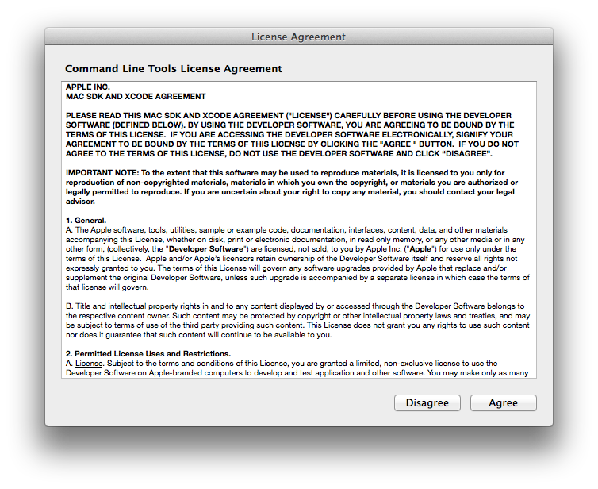
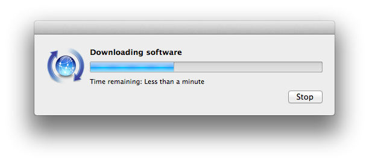
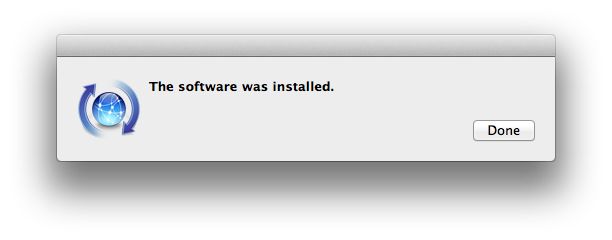

## Development Environment Setup

One of the first things you need to do before you start going through the challenges is to set up the environment with all the applications you need to be able to write and run code. This is optional though. 

You can go through the entire course using a service such as [Cloud9](https://c9.io/) or [Koding](https://koding.com/). Using any of these services means you get access to a system “in the cloud” that you can reach from your web browser. You can access the hosted development environment from any computer that is connected to the internet. Both Cloud9 and Koding have free plans and both allow several developers to collaborate and share code. Another handy service you can use to share cod (but not execute it) is [Kobra.io](https://kobra.io) that also comes with handy video chat. 

If you want to know more about Cloud services and how to set them up, please see chapter ['Working in the Cloud']()

Alright, let's focus on how to set up your local development environment. We'll be covering both OSX and Linux, so jump to whatever section suites you. 

Are you a Windows user? Well, two things; '*I'm sorry to hear that*' and '*Please see chapter ['Working in the Cloud']()*'

### OSX

Launch the Terminal, found in `/Applications/Utilities/`

#### Xcode Command Line Tools
[Xcode](https://developer.apple.com/xcode/) is an integrated development environment (IDE) with a suite of tools for developing software for OS X and iOS. But Xcode is more than what just meets the eye. Ruby gems often use so called "native extensions", that connects them with other non-Ruby components on your machine. Without Xcode installed, you don't have a C/C++/Objective-C compiler installed and can not use those extensions. While installing Xcode you also install LLVM, GCC, and many other developer tools. 

For the purpose of this course, we are going to install Xcode Command Line Tools, a part of the Xcode IDE, without installing the entire Xcode package. 

Check if Xcode Command Line Tools are installed:
```shell
$ xcode-select -p
```

Install:
```shell
$ xcode-select --install
```






Verify installation:
```shell
$ xcode-select -p
/Library/Developer/CommandLineTools
# or: 
/Applications/Xcode.app/Contents/Developer
```

Also, verify that LLVM-GCC is installed:

```shell
$ gcc --version
Configured with: --prefix=/Applications/Xcode.app/Contents/Developer/usr --with-gxx-include-dir=/usr/include/c++/4.2.1
Apple LLVM version 7.0.0 (clang-700.1.76)
Target: x86_64-apple-darwin14.5.0
Thread model: posix
```

RVM


