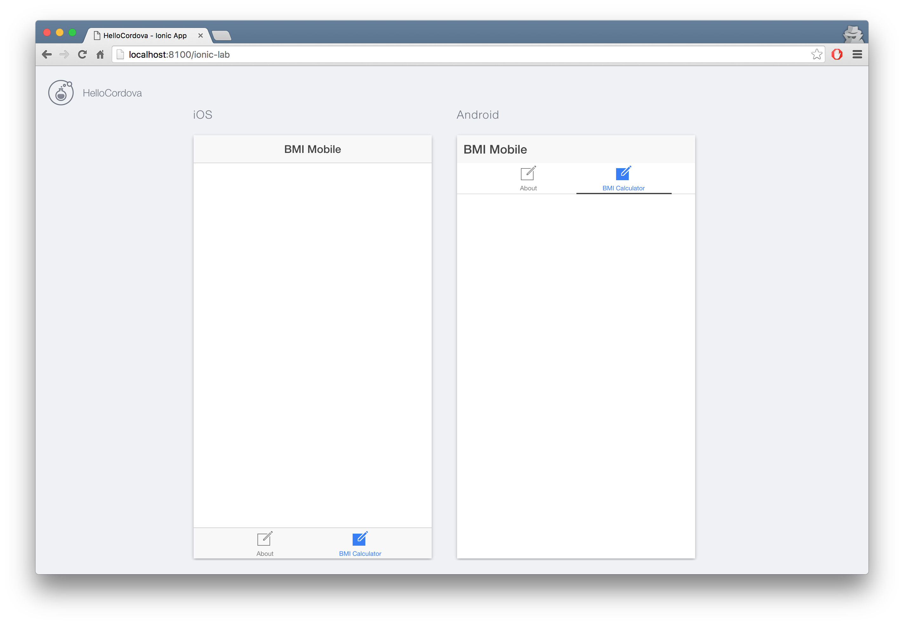

## Adding the calculator tab

In order to add the view where we will be displaying our calculator, we need to go through same steps that we did when adding the About view.
 1. Create a tab that will display the view
 2. Add a route and point it to a template and a controller.
 2. Create a controller (we will call it `BmiContoller`)
 3. Add a HTML template for the view

Let's open the `www/templates/tabs.html` file and add the markup for the tab:
```html
<!-- www/templates/tabs.html -->

<!-- BmiTab -->
<ion-tab title="BMI Calculator" icon-off="ion-ios-compose-outline" icon-on="ion-ios-compose" href="#/tab/bmi">
  <ion-nav-view name="tab-bmi"></ion-nav-view>
</ion-tab>
```

Create the route in `www/js/app.js` by adding the following ABOVE the About rout (the reason for that is that you might mess up some semicolon settings at the end of the block) 

```javascript
// www/js/app.js

[...]
.state('tab.bmi', {
  url: '/bmi',
  views: {
    'tab-bmi': {
      templateUrl: 'templates/calculator/calculator.html',
      controller: 'BmiController'
    }
  }
})

.state('tab.about', {
  url: '/about',
  views: {
    'tab-about': {
      templateUrl: 'templates/about/about.html',
      controller: 'AboutController'
    }
  }
});
```
Now, let's create the controller in `www/js/controllers.js`. (Again, watch the semicolon!) 

```javascript
// www/js/controllers.js
.controller('BmiController', function() {

});

```

And finally, let's create the template. 
```
$ mkdir www/templates/calculator
$ touch www/templates/calculator/calculator.html
```

Open the file and add some basic content:

```html
<!-- www/templates/calculator/calculator.html -->

<ion-view title="BMI Calculator">
  <ion-content>
    <div class="row">
      <div class="col">

      </div>
    </div>
  </ion-content>
</ion-view>

```

At this point you should be able to navigate between the two tabs we've set up if you visit your app in the browser. 




