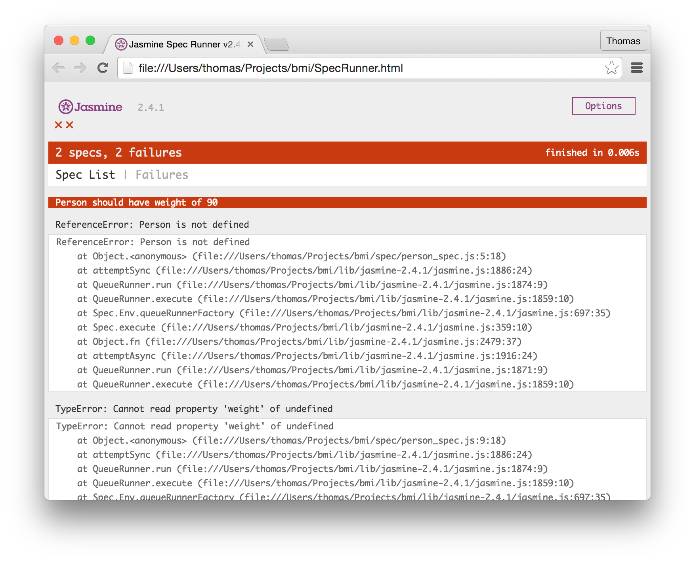
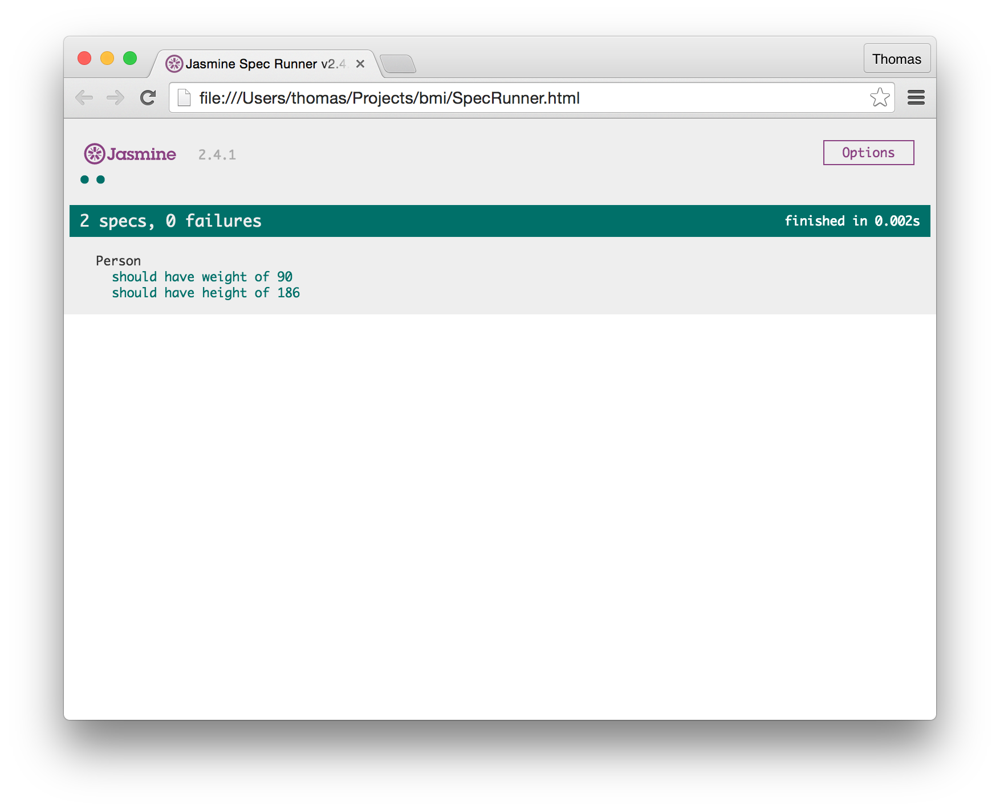
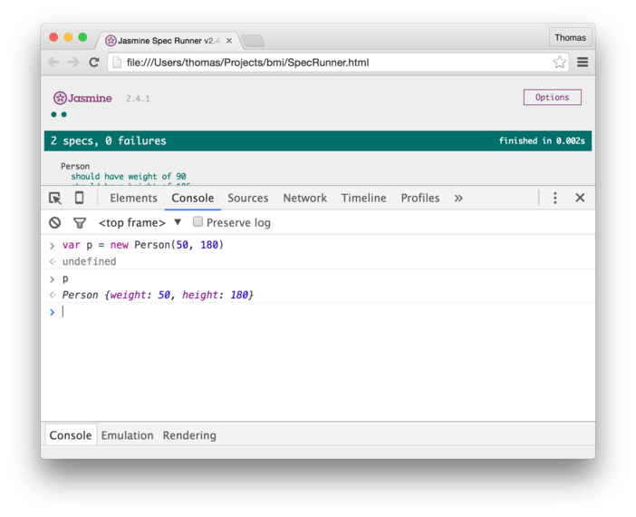

## First tests


Create a new file in your `spec` folder. Call it `person_spec.js`.

```shell
$ touch spec/person_spec.js
```

*** Note that I use the `snake case` format for my file names. You are free to use any format you want but be consistent. ***

We are going to write two test for our Person object. In order to calculate the BMI we will be needing a Person to have two attributes, Weight and Hight.

```js
# spec/person_spec.js

describe("Person", function() {
  var person;

  beforeEach(function() {
    person = new Person({weight: 90, height: 186});
  });

  it("should have weight of 90", function() {
    expect(person.weight).toEqual(90);
  });

  it("should have height of 186", function() {
    expect(person.height).toEqual(186);
  });
});
```

If you reload your `SpecRunner.html` you'll get two errors. 


Let's implement the code that makes this test pass.

In your `src` folder, create a file named `person.js`. Add the following code to that file:

```js
# src/person.js

function Person(attr) {
  this.weight = attr.weight;
  this.height = attr.height;
};
```

If you run your tests again, by reloading `SpecRunner.html` you'll see that our two initial tests are passing. 



Okay, the next thing I want you to do is to right clicj anywhare on the browser window and choose `Inspect` from the pop-up menu. That opens the developer console. Try creating a new instance of a `Person` by following the example below.



Cool, the browsers console can function as a way to manually tests your units and functions - similarly to rubys `irb`. 

Let's write some more tests. 

```js
# spec/person_spec.js

it("should calculate BMI value", function() {
    person.calculate_bmi();
    expect(person.bmiValue).toEqual(26.01)
  });

  it("should have a BMI Message", function() {
    person.calculate_bmi();
    expect(person.bmiMessage).toEqual("Overweight")
  });
```

In those tests we are calling a `calculate_bmi()` function on the `person` object we have created. This will fail since we have no such function defined. 

```js
# src/person.js

Person.prototype.calculate_bmi = function() {
  this.bmiValue = 26.01;
  this.bmiMessage = "Overweight"
};
```

That implementation vill make the test pass, but it is not what we want, is it? We have just passed in some hard coded values in to that function. 

Let's instead call the `BMICalculator` to do the calculation for us by changing the code to:

```js
# src/person.js

Person.prototype.calculate_bmi = function() {
  calculator = new BMICalculator();
  calculator.metric_bmi(this);
};
```
Here we are instantiating a new `BMICalculator` object and calling a function we call `metric_bmi` on it. We are also passing in the current instance of Person to that function. At this point we need to shift our attention to the other spec file we need and test the behaviour of the `BMICalculator`.

