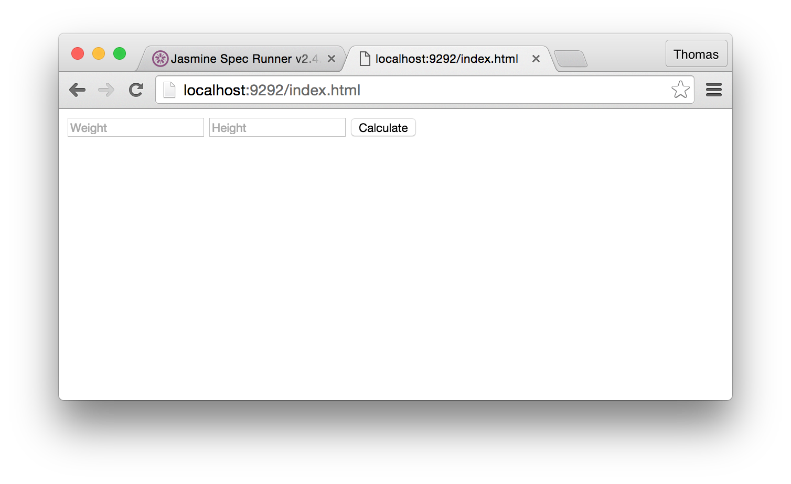
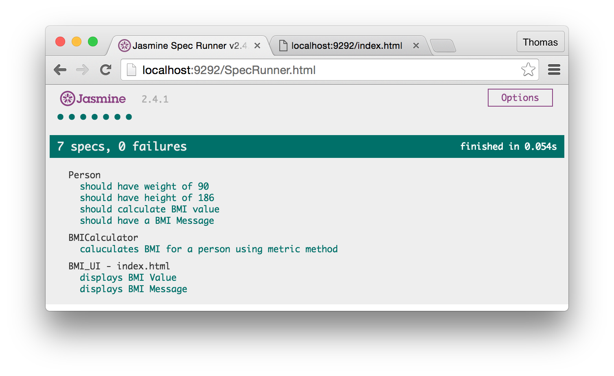

## Acceptance tests

In order to be able to load the `index.html` as a fixture in Jasmine, we need to have a local web server up and running locally. If we don't we simply can not run tests on the web interface due to CORS conflicts. 

In your main project folder, create a file called `Gemfile` (note that there is no suffix and that the file name starts with a capital 'G') and add the following lines.

```ruby
# Gemfile

gem 'rack'
gem 'sinatra'
```

Also, create two other files in the main project folder:
* `config.ru` ** <- Note the suffix!**
* `server.rb`

Add the following code to each of the files:
```ruby
# config.ru

require './server'

run Sinatra::Application

```

```ruby
# server.rb

require 'sinatra'

set :public_folder, proc { File.join(root) }
```

Now, head over to your terminal and start the local web server.
```shell
$ rackup
```
In your browser, type in this URL to access the web page you recently created:

```text
http://localhost:9292/index.html
```


You can go ahead and enter some values in the fields and see if everything is working as it should. 

**To stop the server in your terminal, just press the `ctrl` + `C` keys on your keyboard. To start it again, just type `rackup` and press enter.**

At this point, we are ready to add some tests to our `bmi_ui_spec.js`. 

What we want Jasmine to do is to:
1. Fill in the fields for Weight and Height with values.
2. Click the `Calculate` button.
3. Assert that the right content is displayed on the page.

Modify your `bmi_ui_spec.js` with the following code

```ruby
# spec/bmi_ui_spec.js

describe('BMI_UI - index.html', function() {
    beforeEach(function() {
        jasmine.getFixtures().fixturesPath = '.';
        loadFixtures('index.html');
        $.holdReady(false);
        $('#weight').val('90');
        $('#height').val('186');
        $('#calculate').trigger('click');
    });
    
    it("displays BMI Value", function() {
        expect($('#display_value').text()).toBe('Your BMI is 26.01');
    });

    it("displays BMI Message", function() {
        expect($('#display_message').text()).toBe('and you are Overweight');
    });
});
```
Why do we need the `beforeEach` block? What are the last three lines of that block doing?

Now, run your tests by pointing your browser to the following URL.


```text
http://localhost:9292/SpecRunner.html
```

