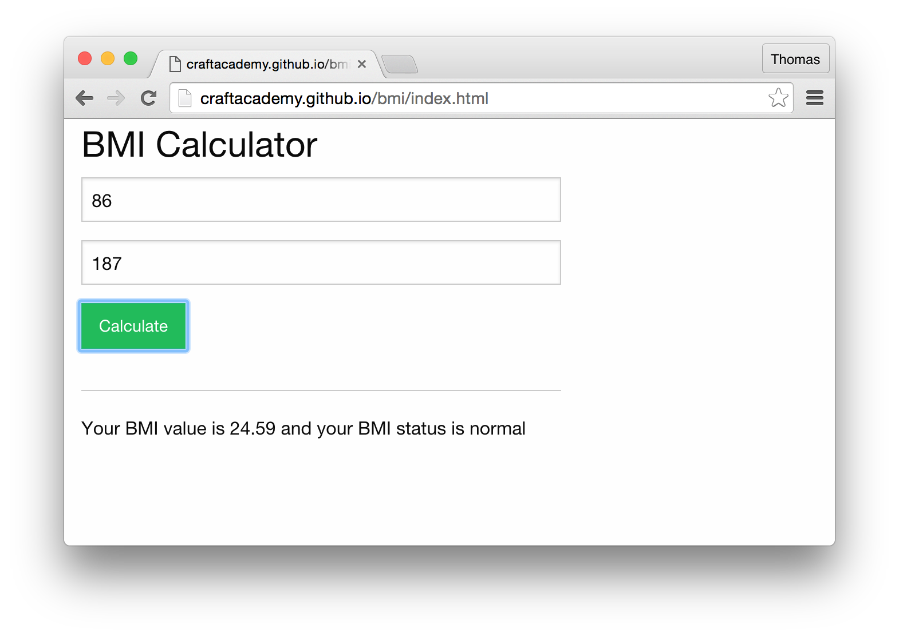

## Moving on

At this point, we will shift gears and allow you to work for yourself. There is plenty of functionality left to implement. 

1. Add a function to calculate BMI using the imperial method.
2. Modify the UI to allow the user to choose between the Metric- and Imperial methods
3. Add some CSS to the web interface to create a better look and feel of the application - why not use some of the great frameworks available out there, like [ZURB Foundation](http://foundation.zurb.com/) or [Twitter Bootstrap](http://getbootstrap.com/)?
4. Create a local repository and push up your code to GitHub
5. Use your github.io repository to deploy your own version of the calculator


If you want to find some inspiration you can have a look at a slightly styled version of the BMI Calculator that we have deployed using gh-pages to github.io.

```
http://craftacademy.github.io/bmi/index.html
```




