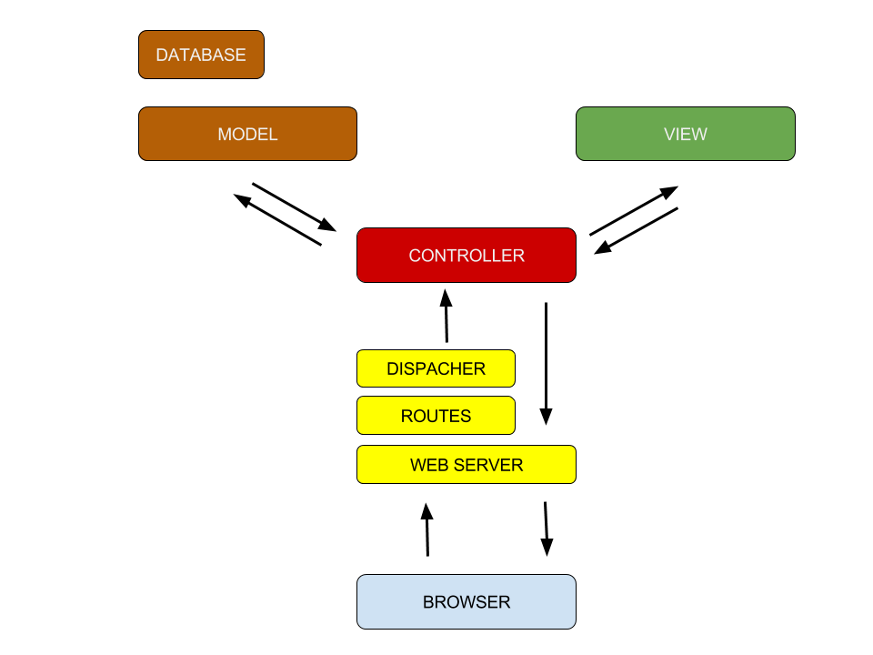

## Model View Controller
Model View Controller (MVC) is a 3-tiered architectural software design pattern for implementing user interfaces. It divides a given software application into three interconnected parts, to separate internal representations of information from the ways that information is presented to or accepted from the user.

In addition to dividing the application into three kinds of components, the MVC design pattern defines the interactions between them.

* A **Model** stores data that is retrieved according to commands from the **Controller** and displayed in the **View**.
* A **View** generates new output to the user based on changes in the **Model**.
* A **Controller** can send commands to the model to update the **Model's** state. It can also send commands to its associated **View** to change the it's presentation of the **Model**.

It's more fun to imagine a story with “fat model, skinny controller” instead of a sterile “3-tiered architecture”. Models do the grunt work, views are the happy face, and controllers are the masterminds behind it all.

Think about this flow:

* The **browser** makes a request, such as http://localhost:9292/project/show/15

* The **web server** (WEBrick, etc.) receives the request. It uses **routes** to find out which **controller** to use. The web server then uses the **dispatcher** to create a new controller, call the action and pass the parameters.

* The **Controller** do the work of parsing **user requests** (data submissions, cookies, sessions and other  “browser stuff”). They're the pointy-haired manager that orders employees around. The best controller is [Dilbertesque](http://dilbert.com/): It gives orders without knowing (or caring) how it gets done.

* **Models** are Ruby classes extended by ORM methods. They talk to the database, store and validate data, perform the business logic and otherwise do the heavy lifting. They're the chubby guy in the back room crunching the numbers.

* **Views** are what the user sees: HTML, CSS, JavaScript, JSON. They're the sales rep putting up flyers and collecting surveys, at the managers direction. Views are merely puppets reading what the controller gives them. They don't know what happens in the back room.

* Finally, the **Controller** returns the response body (HTML, XML, etc.) & metadata (caching headers, redirects) to the server. The server combines the raw data into a proper HTTP response and sends it to the user.

* The **web server** is the invisible gateway, shuttling data back and forth (users never interact with the controller directly).

