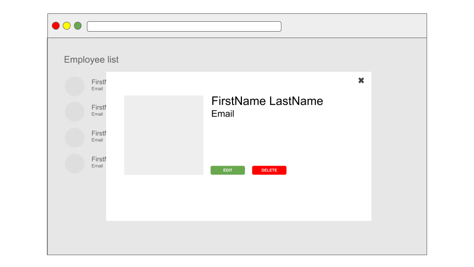

## Getting started

We will build a small application that will allow us to display a list of employees in an organization and allow us to update some basic details about an employee, and even delete an employee record. 

The we can start with a pretty simple lo-fi that can guide us: 


This view will display a list of employees with a cta to view details about an individual employee. Clicking on the button will add an overlay to the view and display a modal (or pop-up) with the employee details. There should alose be 2 cta's for further actions the user will be able to undertake (edit and delete the employee). For now though, there will no functionality attached to them.  



Alright, let's create the first User story and a scenario for this view.

```
As a user of the application
In order to be able to work with employee management
I would like to access a list of employees.
```

Okay, now let's break this down into a check-list of things that need to happen: 

1. The user access the application using her/his browser
2. The application fetches the list of employees from the company's internal systems (exposed to the application by a Rest API endpoint)
3. A view with the employee data is rendered and displayed in the users browser.

We can start with that and write a second User Story once we've finished implementing this first one. 


