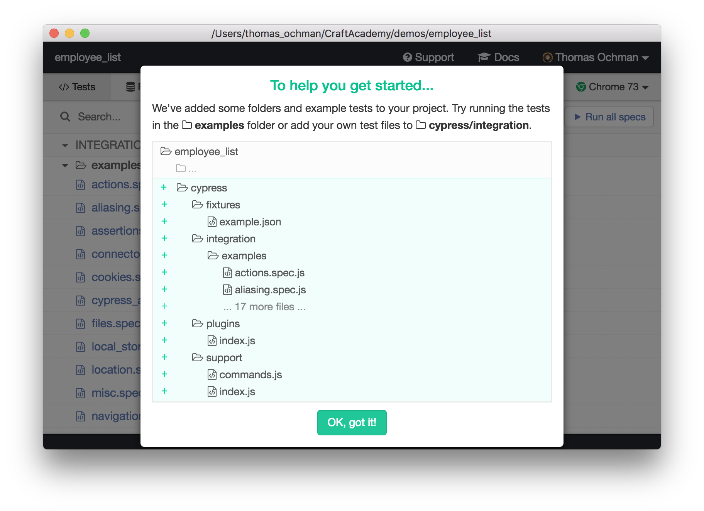

## The tools
Let's write some code. We've decided (or it has been decided for us) that we will use ReactJS in this project. We will use `create-react-app` to scaffold the application. Once the application is generated, we want to clean up some files and remove a lot of the auto-generated code.

```bash
$ yarn create react-app employee_list
$ npx create-react-app employee_management
```

Once you've cleaned up your project files, your structure should look like this:


Now, we want to make some decisions regarding the testing frameworks we want to use.

[Cypress](https://www.cypress.io/) is a Javascript End to End testing framework.


What Cypress brings to the table, is a solid platform for writing and automating UI tests. Powerful features, well written documentation and a very straight forward configuration. Just the way we like it!

**Step 1**: Install `cypress` and save it as a development dependency:

```bash
$ yarn add cypress --dev
// or use npm
$ npm i cypress --save-dev
```

**Step 2**: Once we are done with installation, we can launch cypress by

```bash
$ ./node_modules/.bin/cypress open
```
This command will run a configuration script and add a bunch of example tests that can be a reference for you, and help you to get to know the various Cypress commands. 



**Step 3**: There is no step 3, to be honest... we are done here. Well, not quite perhaps. We should add a script to our `package.json` to help us accesss the test runner in a smoother way. I suggest that you add this to the `scripts` section of the `package.json` file: 

```json
"cy:open": "yarn start --silent & cypress open"
```

I also would like you to modify the `eslintConfig` section to look like this (we want to avoid warnings in our IDE that implies that the `cy` object is undefined):

```json
"eslintConfig": {
  "extends": "react-app",
  "globals": {
    "cy": "cy"
  }
}
```
That should be it... in terms of configuration. 

Well, there's one more thing... (there's always a 'one more thing'). 
Cypress comes with TypeScript type declarations included. Modern text editors can use these type declarations to show IntelliSense inside spec files. The simplest way to see IntelliSense when typing a Cypress command or assertion is to add a triple-slash directive to the head of your test file. This will turn the IntelliSense on a per file basis. paste the comment line below into your test (on top).

```javascript
/// <reference types="Cypress" />
```

**Alright, NOW we are done.**

## Our First Test

Let's start using Cypress. To begin with, create a new test file in the `cypress/integration` folder. I will use a slightly different naming standard than the one proposed in the examples (more on this topic later). 

```bash
$ touch cypress/integration/displayEmployeeList.feature.js
```

Add a `describe` block:

```javascript
describe('Display list of employees', () => {
  // Our tests will go here
})
```

Time to start cranking out the tests! Let's start with a simple one - can we visit the site and see the text we placed in the `section` we called `header`?

```javascript
it('when user visits the page', () => {
    cy.visit('http://localhost:3000')
    cy.get('section[name="header"]')
      .should('contain', 'Employee list')
})
```

Remember - all **`it`** blocks need to go inside the `describe` block.

Before we run our tests, we need to keep our localhost active in another terminal. Start it by running `$ yarn start` or `$ npm start`. (Moving forward, we will only type out the `yarn` commands - if you want to use `npm`, you just go ahead and use it...)

Let's launch Cypress by executing the script: `$ yarn run cy:open`. A cypress window will pop open with a list of available tests (in out case, just 1 file). Clicking the file name will trigger the test runner and a new broweser window will pop up.


There's not much to see here, but the test we just wrote should pass. 


