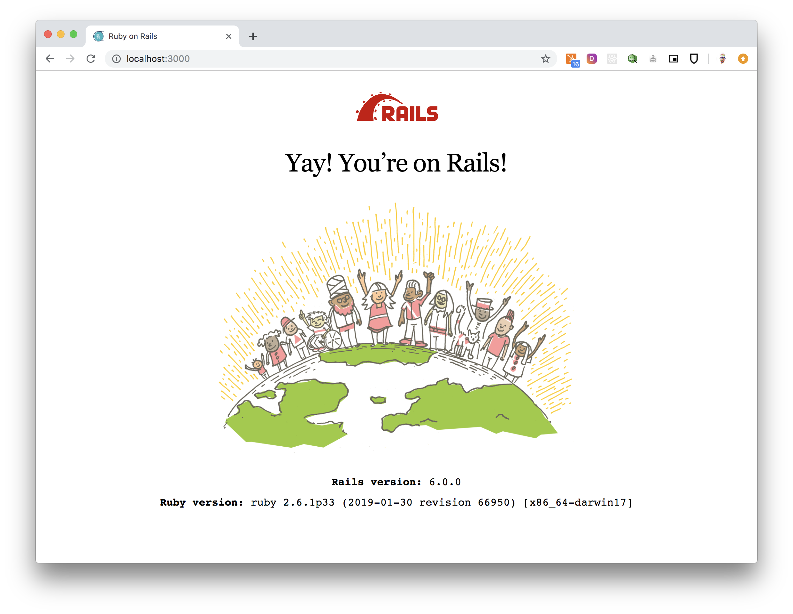

## Project setup

We will start by setting up a new Rails 6 project, but for the sake of this demo, we will opt-out of some libraries that we wnon't use anyway. These are:
* ActionMailer
* ActionMailBox
* ActiveStorage
* ActionText
* ActionCable

We will also opt-out of some default testing libraries in favor of RSpec and Cucumber.


#### Execution
```bash
$ rvm use 2.6.1
$ gem install bundler
$ rvm gemset create rails_6
$ rvm gemset use rails_6
$ gem install rails
$ rails new stripe_rails --database=postgresql --skip-test --skip-system-test --skip-action-mailer --skip-action-mailbox --skip-action-text --skip-active-storage --skip-action-cable
```

The next thing we want to do is to clean our `Gemfile` from some dependencies we won't be using, and make sure we install everything by executing the `bundle install` command. 

We will also add a tool that will make debugging easier. [Pry](https://github.com/pry/pry) is a powerful alternative to the standard IRB shell for Ruby. [`pry-rails`](https://github.com/rweng/pry-rails) causes Rails console to open pry. [`pry-byebug`](https://github.com/deivid-rodriguez/pry-byebug) adds step-by-step debugging and stack navigation capabilities to pry.

_**Gemfile**_

```ruby
source 'https://rubygems.org'
git_source(:github) { |repo| "https://github.com/#{repo}.git" }

ruby '2.6.1'

gem 'rails', '~> 6.0.0'
gem 'pg', '>= 0.18', '< 2.0'
gem 'puma', '~> 3.11'
gem 'webpacker', '~> 4.0'
gem 'turbolinks', '~> 5'
gem 'bootsnap', '>= 1.4.2', require: false

group :development, :test do
  gem 'pry-rails'
  gem 'pry-byebug'
end

group :development do
  gem 'web-console', '>= 3.3.0'
  gem 'listen', '>= 3.0.5', '< 3.2'
  gem 'spring'
  gem 'spring-watcher-listen', '~> 2.0.0'
end
```

Now, we want to install and configure everything (including our database), and make sure tha application works properly.

#### Execution

```bash
$ bundle install
$ rails db:create db:migrate
$ rails server
```

The last command fires up a local web server. Open up your browser and navigate to `http://localhost:3000`. You should be able to see the following page.



## Wrap up
At this point, we have a basic application structure that we can continue to build upon. Please take a close look at the folder and file structure to get acquainted with the application.

In the next section, we will continue with the development environment setup, and focus on adding the appropriate testing frameworks.

```
├── app
│   ├── models
│   ├── javascript
│   ├── jobs
│   ├── controllers
│   ├── views
│   ├── assets
│   └── helpers
├── bin
│   ├── rake
│   ├── setup
│   ├── bundle
│   ├── yarn
│   ├── webpack
│   ├── webpack-dev-server
│   ├── spring
│   └── rails
├── config
│   ├── routes.rb
│   ├── locales
│   ├── environments
│   ├── spring.rb
│   ├── master.key
│   ├── environment.rb
│   ├── application.rb
│   ├── puma.rb
│   ├── credentials.yml.enc
│   ├── database.yml
│   ├── webpack
│   ├── boot.rb
│   ├── webpacker.yml
│   └── initializers
├── config.ru
├── node_modules
├── README.md
├── Rakefile
├── yarn.lock
├── public
│   ├── favicon.ico
│   ├── 422.html
│   ├── apple-touch-icon.png
│   ├── 500.html
│   ├── 404.html
│   ├── apple-touch-icon-precomposed.png
│   └── robots.txt
├── babel.config.js
├── package.json
├── lib
│   ├── tasks
│   └── assets
├── db
│   ├── schema.rb
│   └── seeds.rb
├── Gemfile
├── Gemfile.lock
├── log
├── postcss.config.js
├── tmp
└── vendor
```
