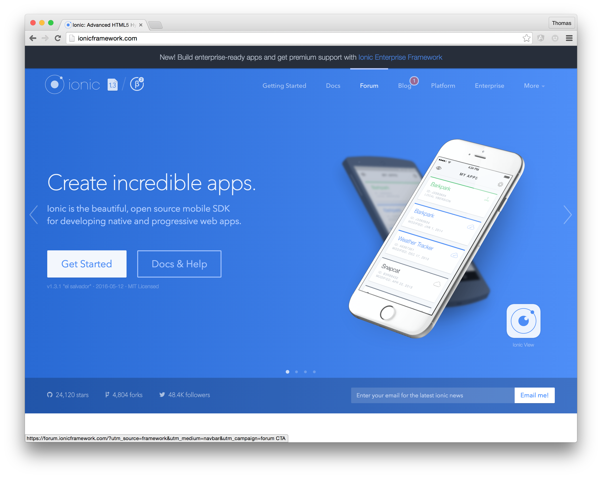

# Going mobile with Ionic
**We are spending more time online than with any other media
and much of that digital time is spent on mobile devices.
Most of that time is spent in apps rather than in the mobile browser.**

But hold on! My website is responsive, so why do I need a mobile App?

Responsive web design is just one part of a complete mobile strategy. Responsive designed sites ensure that no matter which device is being used, visitors are met with a usable experience. Native apps, on the other hand, take the mobile experience to the next level. At their best, they do more than just repackage existing content and functionality; they also present navigation, content, and functionality in a way specifically optimized for the measurably different ways in which people actually use their mobile devices. 

###Hybrid app development with Ionic
Ionic is an HTML5 mobile app development framework targeted at building hybrid mobile apps. Hybrid apps are essentially small websites running in a browser shell in an app that have access to the native platform layer. Hybrid apps have many benefits over pure native apps, specifically in terms of platform support, speed of development, and access to 3rd party code.

Think of Ionic as the front-end UI framework that handles all of the look and feel and UI interactions your app needs in order to be compelling. Kind of like “Bootstrap for Native,” but with support for a broad range of common native mobile components, slick animations, and beautiful design.

Unlike a responsive framework, Ionic comes with very native-styled mobile UI elements and layouts that you would get with a native SDK on iOS or Android but didn’t really exist before on the web. Ionic also gives you some opinionated but powerful ways to build mobile applications that eclipse existing HTML5 development frameworks.

