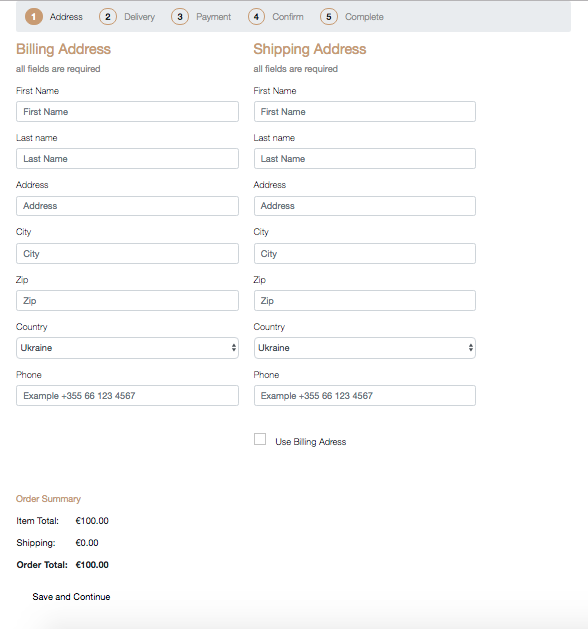
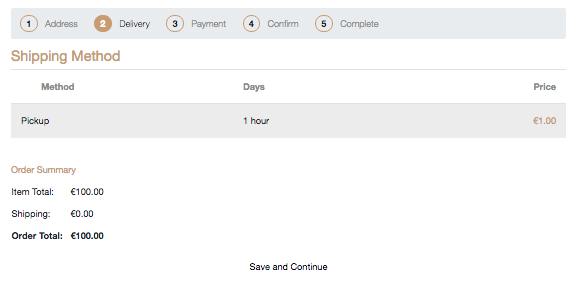
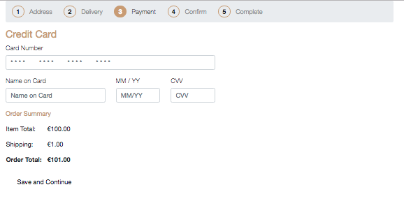
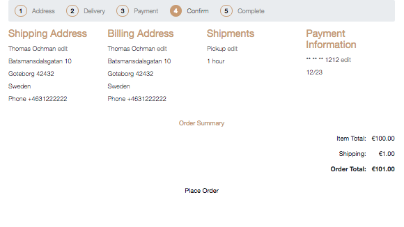
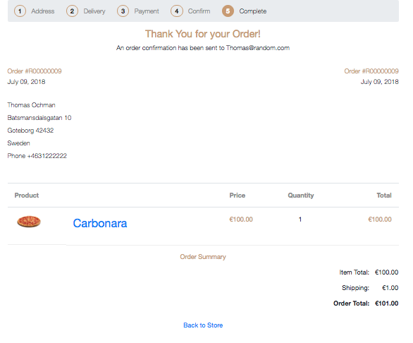

## E-commerce flow using Cartify

### Cartify
Cartify is a gem that provides full (but simple) e-commerce functionality to your Ruby on Rails application. It adds ordering functionality and a multi-step checkout process with a dummy credit card payment flow (adding Stripe or PayPal should not be overly complicated). It is well suited for educational purposes and can be used in the SlowFood Challenge (week 5 of the CA curriculum) 













### About Mountable Engines
What is an engine? And a mountable one? In Rails world it’s just a piece of code, which plugged to existing application, extends its basic functionality. Mountable Engines are a great way to extract code into its own namespace and allow the code to be reused in other applications.

There is a detailed guide to Mountable Engines available on [RailsGuides](http://guides.rubyonrails.org/engines.html).


### Slow Food Challenge
The SlowFood Challenge is about building a simple e-commerce site for a restaurant. The requrements of the application are well documented in the course documentation. IF you choose to use the Cartify gem, you'll get more functionality than requested but can focus on styling and designing the parts of the application that are written by you. Remember that every part of the Cartify flow (views, controllers and models) can ALSO be customized, but it's a bit complicated.

## Usage
The instructions for Cartify can be found on the [Craft Academy fork of the gem](https://github.com/CraftAcademy/cartify). This custom version has been modified by us to work better with Rails 5.x and Turbolinks. 

**Please follow the installation and setup instructions carefully!**

Note that this gem is using Bootstrap 4.1 as a CSS framework. This means that you are kind of locked to that framework, but you CAN use another one. 

If you choose to do so, you will need to make some modifications to your Assets Pipeline settings and remove the requirement of the CSS provided by Cartify. 

Open up `app/assets/stylesheets/application.css` and make sure to remove:

```
 *= require cartify/application
```

Also, copy all unstyled views that has to do with the checkout process to your application using the following command:

```
$ rails g cartify:views --scope unstyled
```

This will copy all view templates related to the checkout process to your main application (you will find them in `app/views/cartify/checkout`). IF you'd like to copy more of the views provided by the gem, you can manually create them following the structure you'll find on [https://github.com/CraftAcademy/cartify/tree/master/app/views/cartify](https://github.com/CraftAcademy/cartify/tree/master/app/views/cartify).

## Gotchas
This is a highly opinionated library that we are using for the first time. It might ba a bit complicated for you to use if you are not used to use [Mountable Engines](http://guides.rubyonrails.org/engines.html) in your Rails application. Don't despair - we are here to help you and make this a good learning experience. 

**Please report any errors or issues you encounter to your coach.** 


