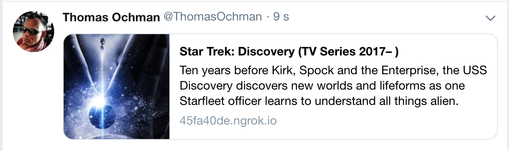
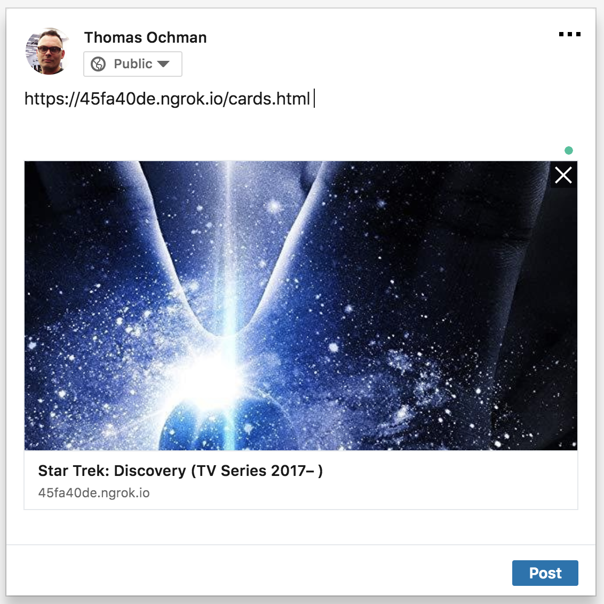

---
title: "Twitter Cards and LinkedIn Previews with Rails"
subtitle: "Open Graph - The Essential Meta Tags for Social Media"
author: [Craft Academy - Coding as a Craft]
date: Version 0.1
subject: "JavaScript, Rails"
keywords: [JavaScript, Rails, Social Media, Twitter, Facebook, LinkedIn]
titlepage: true
titlepage-color: f28e24
titlepage-text-color: "FFFFFF"
titlepage-rule-color: "FFFFFF"
titlepage-rule-height: 2
...

## Introduction 
You want a nice preview when your applications content is shared on Twitter, LinkedIn, Facebook and other sites? That's a good idea – it looks better and people are more attracted to click on links and drive traffic to your system. 
In this guide, we'll be adding some **meta tags** to your webapplication to make it more easily shared on various social networks. Let's build a simple Rails solution.

## Open Graph - The Essential Meta Tags for Social Media

The Open Graph Protocol is a set of tags that allows developers to give major social networks (Facebook, Twitter, Linked in...) detailed information about its pages and content. This information is used by social networks to better display a link on those pages that have been placed by the users.

**Is Open Graph relevant for Search Engine Optimization?**

In theory, the impact of the Open Graph on SEO is limited. The protocol is intended primarily for social networks and not for search engines like Google, Bing, Yahoo, etc. In practice, however, the social networks, like Facebook for example, have become so important in recent years that the search engines can’t ignore the Open Graph data in their algorithms.

To add the Open Graph protocol, you must simply:

* Add the namespace "http://ogp.me/ns#" to the html tag
* Between the head tags, you must add the meta tags with their property and content attributes
* The specifications define 4 Open Graph tags like "Requirements" : og:title, og:type, og:url, og:image
* Other tags are also useful.


The four required properties for every page are:

* `og:title` - The title of your object as it should appear within the graph, e.g., "The Rock".
* `og:type` - The type of your object, e.g., "video.movie". Depending on the type you specify, other properties may also be required.
* `og:image` - An image URL which should represent your object within the graph.
* `og:url` - The canonical URL of your object that will be used as its permanent ID in the graph, e.g., "http://www.imdb.com/title/tt0117500/".
* (optional but good to include) `og:description` - A short description or summary of the object. Between 2 and 4 sentences.


As an example, the following is the Open Graph protocol markup for the movie The Rock on IMDB:

```html
<html prefix="og: http://ogp.me/ns#">
  <head>
    <title>Star Trek: Discovery (TV Series 2017– )</title>
    <meta property='og:title' content="Star Trek: Discovery (TV Series 2017– )" />
    <meta property='og:type' content="video.tv_show" />
    <meta property='og:image' content="https://ia.media-imdb.com/images/M/MV5BMjM3NDA1NjM1Nl5BMl5BanBnXkFtZTgwNzg5ODEzMzI@._V1_UY1200_CR96,0,630,1200_AL_.jpg" />
    <meta property="og:url" content="http://www.imdb.com/title/tt5171438/" />
    <meta property="og:description" content="Ten years before Kirk, Spock and the Enterprise, the USS Discovery discovers new worlds and lifeforms as one Starfleet officer learns to understand all things alien." />
    ...
  </head>
  <body>
  ...
  </body>
</html>
```


## Twitter

Twitter card tags look similar to Open Graph tags, and are based on the same conventions as the Open Graph protocol.

Twitter has its own <meta> tags that are similar to the Open Graph protocol, but uses the `twitter:` prefix instead of `og`. As with Facebook, only a few are required, but for the sake of brevity, we can leverage the fact that Twitter allows us to substitute the Open Graph `<meta>` tags for its own.

In practical terms, the only tag we need to add, to be in control of how Twitter displays our site is the `twitter:card` tag that specifies the card type, which will be one of “summary”, “summary_large_image”, “app”, or “player”.

```html
<head>
  <title>Star Trek: Discovery (TV Series 2017– )</title>
  <meta property='og:title' content="Star Trek: Discovery (TV Series 2017– )" />
  <meta property='og:type' content="video.tv_show" />
  <meta property='og:image' content="https://ia.media-imdb.com/images/M/MV5BMjM3NDA1NjM1Nl5BMl5BanBnXkFtZTgwNzg5ODEzMzI@._V1_UY1200_CR96,0,630,1200_AL_.jpg" />
  <meta property="og:url" content="http://www.imdb.com/title/tt5171438/" />
  <meta property="og:description" content="Ten years before Kirk, Spock and the Enterprise, the USS Discovery discovers new worlds and lifeforms as one Starfleet officer learns to understand all things alien." />
  <meta name="twitter:card" content="summary">
  ...
</head>
```
When shared, the Star Trek Discovery page on IMDB could look something like this in the Twitter feed:



And on LinkedIn, sharing a link to this page would render something like this:



_ Note: I used [Ngrok](https://ngrok.com/) to generate public URLs for sending previews to clients.

More information about the Open Graph protocol (advanced) can be found at http://ogp.me/

## Implementing in Rails

First, I think you don't need OG previews for each page. It only makes sense for pages that will be shared – e.g. your home page and any instances of pages that will have different content (like articles, movies, jobs, etc).

We want a simple and flexible solution. So we define a placeholder with yield in our layout file and let the view template fill it with `content_for`. Here is the layout file:

```haml
# app/views/application.html.haml
%html
  %head
    # ...
    = yield :og_header
    = tag(:meta, property: "twitter:site", content: "@CraftAcademySE")
    # ...
```

The Twitter username of the site is the same for all pages. That's why we put it directly in the layout file.

In our views, we define the meta tags within a content_for block. The home page view could be:

```haml
# app/views/home/index.html.haml
- content_for :og_header
  = tag(:meta, property: "og:title", content: "The Title")
  = tag(:meta, property: "og:description", content: "The Description")
  = tag(:meta, property: "og:image", content: asset_url("summary-large-card-tweet.png"))
  = tag(:meta, property: "twitter:card", content: "summary_large_image")
  ```

  We use the `asset_url` helper to specify the image – this helper gets us the absolute URL and uses the asset pipeline. The image would be stored in `app/assets/summary-large-card-tweet.png`.

  Here is an example of what the article page view could look like:

  ```haml
# app/views/blog/articles/show.html.haml
- content_for :og_header do
  = tag("meta", property: "og:title", content: @article.title)
  = tag("meta", property: "og:description", content: strip_tags(@article.excerpt))
  = tag("meta", property: "og:image", content: asset_url("logos/logo-square-250x250.png"))
  = tag("meta", property: "twitter:card", content: "summary")
  = tag("meta", property: "twitter:creator", content: "@tbuehl")
```

  You find yourself inserting the same code in a lot of views, or you just want a default for all pages? A "default setting" in your layout could be one way to solve this. For example:

```haml
# app/views/layouts/application.html.haml
%html
  %head
    # ...
    if content_for?(:og_header)
      = yield :og_header
    - else
      = render "layouts/default_og_header"
    # ...
```

```haml
# app/views/layouts/_default_og_header.html.haml
= tag(:meta, property: "og:title", content: "The Title")
= tag(:meta, property: "og:description", content: "The Description")
# ...
```

You can preview your card using the [Card Validator](https://cards-dev.twitter.com/validator) before sharing them on Twitter.

## Wrap up
With this, relatively simple technique, you can make sure that your links are displayed properly across various social media platforms. 

