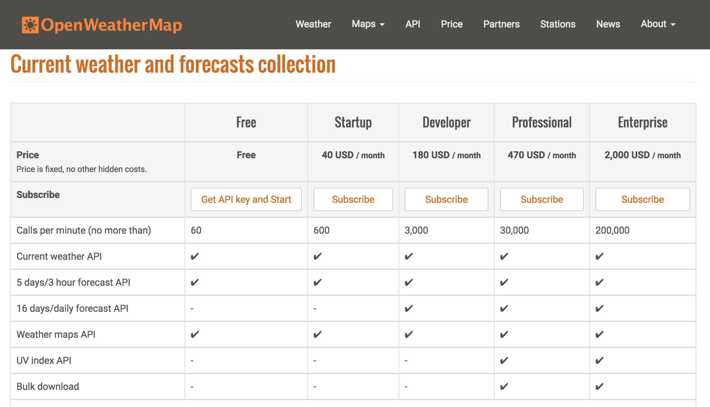

##Open Weather Challenge

You are challenged with building a simple one page application that allows the user to display the current weather on his location. Use [OpenWeatherMap](http://openweathermap.org/) API for current weather information. 


### Functionality
The functionality we are looking for is pretty simple yet not in any way trivial.
1. When the web page is being accessed, get the users current position using the `navigator.geolocation.getCurrentPosition()` method.
2. Get the weather info for the obtained position by querying the OWM API
3. Parse the response
4. Display appropriate information on the web page without reloding the page. 

### Learning objective
- Learn how to get hold of data from an external source.
- Learn about AJAX and DOM manipulation
- Learn how to stub network calls in Jasmine
 
### Technology
In order to access the weather service you need to sign up for the FREE tier on their website and get an API key.




Invalid API call will result in the following response:
```json
{  
   "cod":401,
   "message":"Invalid API key. Please see http://openweathermap.org/faq#error401 for more info."
}
```

Valid API call for Gothenburg, Sweden will result in following response:
```json
{  
   "coord":{  
      "lon":11.97,
      "lat":57.71
   },
   "weather":[  
      {  
         "id":802,
         "main":"Clouds",
         "description":"scattered clouds",
         "icon":"03n"
      }
   ],
   "base":"cmc stations",
   "main":{  
      "temp":288.71,
      "pressure":1027.36,
      "humidity":93,
      "temp_min":288.71,
      "temp_max":288.71
   },
   "wind":{  
      "speed":4.63,
      "deg":45,
      "gust":7.2
   },
   "clouds":{  
      "all":36
   },
   "dt":1471467557,
   "sys":{  
      "type":3,
      "id":9444,
      "message":0.01,
      "country":"SE",
      "sunrise":1471405395,
      "sunset":1471459624
   },
   "id":2689287,
   "name":"Nordstaden",
   "cod":200
}
```

