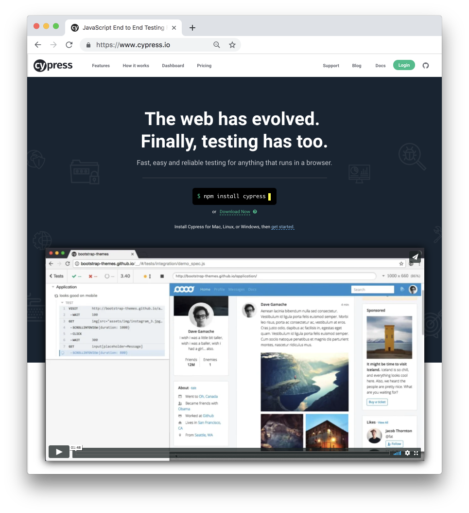

# Cypress Testing Framework

[Cypress](https://www.cypress.io/) is a Javascript End to End testing framework.



In contrast to Puppeteer, which is a library, Cypress gives you a solid platform for writing and automating UI tests. Without worrying too much about the rest.

## Install and setup Cypress

Installing cypress is a really complicated process.

**Step1**: You need to run:

`npm i cypress --save-dev`

OR

`yarn add cypress --dev`

That's it. No, really! we are done here. 

Once we are done with installation, we can launch cypress by

`./node_modules/.bin/cypress open`

But that's far too long, so we create a shortcut in our `package.json` by inserting `"cy:open": "cypress open"` in `scripts`.

Then we can open cypress by
`npm run cy:open`

Once we run cypress for first time, it will create scaffolded folder, with a lot of example tests (Have a look at them, to get a sense of how tests should be written).

Our tests are stored in `Integration` folder and `fixtures` folder will contain JSON files, which we will introduce during the course of this document.

## Our First Test - Say Hello!

To begin with, Create an empty js file `sayHelloToThomas.spec.js`.

Add a describe block which wraps around our tests

```javascript
// cypress/integration/sayHelloToThomas.spec.js
describe('We can say hello to Thomas', () => {
  // Our tests will go here
})
```

Time to start cranking out the tests! let's start with a simple one - can we visit the site?

```javascript
it('by filling in the input and clicking the button', () => {
    cy.visit('http://localhost:3000')
})
```

Remember - all **`it`** blocks need to go inside the `describe`.

Before we run our tests, we need to keep our localhost active in another terminal. Start it by running `$yarn start` or `$ npm start`. (Moving forward, we will only type out the `yarn`commands - if you want to use `nmp, please check the npm documentation for instructions)

Let's launch cypress by typing `$ yarn run cy:open`, and a cypress window will pop open with a list(just 1 file). Select and run the test file.

A new Chrome window will open, and our test will go green! A good idea at this point would be to open console and click around the browswer to explore tools provided by cypress.

Stop the test for now, by clicking `Stop` (Duh!) in cypress window.

Enough fun, let's get some work done!

```javascript

describe('We can say hello to Thomas', () => {
  it('by filling in the input and ckicking button', () => {
    cy.visit('http://localhost:3000')
    cy.get('#greeting-text').type('Hello Thomas')
    cy.get('button').click()
    cy.get('#greeting-display').should('contain', 'Hello Thomas')
  })
})
```