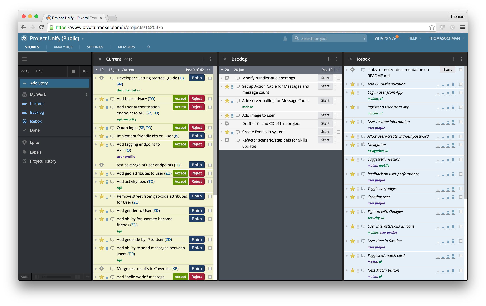

## Pivotal Tracker
**In this project, we will be using Pivotal Tracker as a tool for planning and collaboration. **

Pivotal Tracker is a straightforward project planning tool that allows teams to collaborate and react instantly to real-world changes. It’s based on agile software development methods, but it can be used on a variety of projects. Tracker frees you up to focus on getting things done, without getting bogged down, keeping your plans in sync with reality.

### Get started with PT
Visit www.pivotaltracker.com

1. Sign up for an unlimited 30-Day Free Trial (no credit card required) or click the link in a project invitation email to set your password and sign in.

2. Click **Create Project** on the Dashboard. Enter a name to create a project.

### Project view
We have used Pivotal Tracker for many projects within Agile Ventures. Here is an example of a dashboard for Project Unify. It is a public project and can visit that dashboard on https://www.pivotaltracker.com/n/projects/1525675

### Feature view
Pivotal Tracker allows you to describe each feature, chore or bug in a very detailed way and fully supports the agile methods we use in our project simulations. Here is an example of a feature with a user story, acceptance criteria, complexity points, etc. 

**Remember, the tool you use can support your workflow but it won't do the job for you. You need to add the content and work with maintaining it actively.** 

