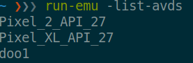

## React Native

React Native is a JavaScript framework for writing real, natively rendering mobile applications for iOS and Android. It’s based on React, Facebook’s JavaScript library for building user interfaces, but instead of targeting the browser, it targets mobile platforms. In other words: web developers can now write mobile applications that look and feel truly “native”. Plus, because most of the code you write can be shared between platforms, React Native makes it easy to simultaneously develop for both Android and iOS.

### Installation

We will be using Expo to build and our application and I will quote their documentation for introduction

> ### The fastest way to build an app.
>
> With Expo tools, services, and React Native, you can build, deploy, and quickly iterate on native iOS and Android apps from the same JavaScript codebase.
>
> - Access to device capabilities like camera, location, notifications, sensors, haptics, and much more, all with cross-platform APIs.
> - Build service gives you app-store ready binaries and handles certificates, no need for you to touch Xcode or Android Studio.
> - Over-the-air updates let you update your app at any time without the hassle and delays of submitting to the store.

#### Mac

```sh
$ npm install -g expo-cli
```

##### iOS simulator

Install [Xcode through the Apple App Store](https://itunes.apple.com/app/xcode/id497799835). It'll take a while, go have a nap. Next, open up Xcode, go to preferences and click the Components tab, install a simulator from the list.

#### Ubuntu

```sh
$ npm install -g expo-cli
```

#### Android Studio

The installation for Android Studio is lengthy one and you have to make sure you do everything required to install it. **Do Not Skip Any Steps**

Visit this [page](https://facebook.github.io/react-native/docs/getting-started) and select `React Native Cli Quickstart` - Development OS: `Linux` - Target OS: `Android`.
Before you start installing run the command `echo $0` and if the response is `zsh` then whenever you see instructions to add anything to `.bash_profile` you should put it in `~/.zshrc` instead.

#### Running Android Emulator

We can either go through Android Studio and access the avdmanager to start an emulator or start it from the terminal. **if avdmanager inside Android Studio gives an illegal java error use the terminal way**.

##### Avdmanager - GUI

1. Start up Android Studio.
2. Click on Configure.
3. Select AVD Manager.
4. If you dont have a device, click on Create Virtual Device. If you already have a device you can skip to step 9.
5. Select a phone and click next.
6. Download an OS for the phone, Oreo or Pie will do fine, then click next.
7. Click on advanced and find and enable keyboard input.
8. Click on finish.
9. Click on the green play button to start the emulator.

##### Avdmanager - Terminal

1. cd into `~/Android/Sdktools/bin`
2. `./sdkmanager --install "system-images;android-27;google_apis_playstore;x86"`
3. `./avdmanager create avd -n nexus_5x -k "system-images;android-27;google_apis_playstore;x86" --device 'Nexus 5X"`
4. Next open up `~/.zshrc` and add `alias run-emu="$ANDROID_HOME/emulator/emulator"` to it.
5. Now to start up a emulator you run `run-emu @nexus_5x`, you might have to run this command as sudo, if that is the case you can either add it to the alias or always run the command with sudo in front.

```
Couldn't statvfs() path: Permission denied
emulator: ERROR: x86 emulation currently requires hardware acceleration!
Please ensure KVM is properly installed and usable.
CPU acceleration status: This user doesn't have permissions to use KVM (/dev/kvm)
```

6. If you want to get a list of set up emulators run `run-emu -list-avds`

   

7. You can run any of the listed emulators with the `run-emu` command, just remember to put `@` in front of the emulator name like `run-emu @doo1`

### Creating a new application

1. `$ expo init [NAME]`.
2. select blank project.
3. Type in the terminal the name of the application when asked.
4. Make sure that `node_modules/**/*` and `.expo/*` folder is in gitignore.
5. yarn start
6. If on ubuntu run `run-emu @nexus_5x` to start up an emulator.

#### Hello World

Replace the content on `app.js` with this

```js
import React, { Component } from "react";
import { Text, View } from "react-native";

export default class HelloWorldApp extends Component {
  render() {
    return (
      <View style={{ flex: 1, justifyContent: "center", alignItems: "center" }}>
        <Text>Hello, world!</Text>
      </View>
    );
  }
}
```
