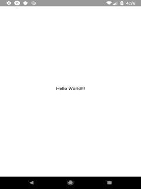

# React Native

## News Room

[WIP]

### Installation

[WIP]

#### Mac

[WIP]

#### Ubuntu

[WIP]

### Setting up a new project

Replace NAME with the name of your application

1. `$ expo init [NAME]`.
2. select blank project.
3. Type in the terminal the name of the application when asked.
4. Make sure that `node_modules/**/*` and `.expo/*` folder is in gitignore.

### Clean upp app.js

Before we clean out the `app.js` file lets take a look at some of the things in there.

#### View and Text

If we look at the render method.

```js
render() {
  return (
    <View style={styles.container}>
      <Text>Open up App.js to start working on your app!</Text>
    </View>
  );
}
```

We will see that we have components called `View` and `Text`, `<Text>` is a built-in component that just displays some text ( like `h1` and `p` tags in html) and View is like the `<div>` or `<span>`.

#### Style

To style our application we first create a `StyleSheet` and in it we create a hash with the key a name we can call we want to use the styles and the value is a hash of normal css styles, except names are written using camel casing, e.g `backgroundColor` rather than `background-color`.

```js
const styles = StyleSheet.create({
  container: {
    flex: 1,
    backgroundColor: "#fff",
    alignItems: "center",
    justifyContent: "center"
  }
});
```

All of the core components accept a props called `style` and in it we pass the `styles` variable and the key containing the styles we want to apply.

```js
<View style={styles.container}>
```

Now that we got that out of the way lets remove unused code in the `app.js` and import our `HomeScreen`.

```js
import React from "react";
import HomeScreen from "./Screens/Home/HomeScreen";

export default class App extends React.Component {
  render() {
    return <HomeScreen />;
  }
}
```

### Create a HomeScreen

[WIP]

Start with creating a folder where we will keep all of our screens and a landing screen for our app.

1. `$ mkdir Screens`
2. `$ mkdir Screens/Home`
3. `$ touch Screens/Home/HomeScreen.js`

And in the `HomeScreen.js` lets add some hello world text.

```js
import React from "react";
import { StyleSheet, Text, View } from "react-native";

export default class HomeScreen extends React.Component {
  render() {
    return (
      <View style={styles.container}>
        <Text>Hello World!!!</Text>
      </View>
    );
  }
}

const styles = StyleSheet.create({
  container: {
    flex: 1,
    backgroundColor: "#fff",
    alignItems: "center",
    justifyContent: "center"
  }
});
```



What we really want to be displaying in our `HomeScreen` is all of our articles and lets start with creating a service that will fetch the articles from a server.

### Fetching articles

1. `$ mkdir Services`
2. `$ touch Services/ArticlesApiService.js`

In the `ArticlesApiService.js` lets setup a function that fetches the articles from our backend.
I have added both a link to my localhost server and the heroku server then I can switch between them depending what backend I want to use.

```js
import axios from "axios";

// const url = `http://192.168.1.178:3000`;  // whenever we want to make api calls to localhost we have to use the ip address not the keyword `localhost` since that can result in a network error.
const url = `https://your-heroku-address`;

export const getArticles = async () => {
  try {
    let response = await fetch(url + `/api/articles`, {
      method: "GET",
      headers: {
        Accept: "application/json",
        "Content-Type": "application/json"
      }
    });
    const articles = JSON.parse(response._bodyInit)["articles"];
    return articles;
  } catch (error) {
    console.error(error);
  }
};
```
