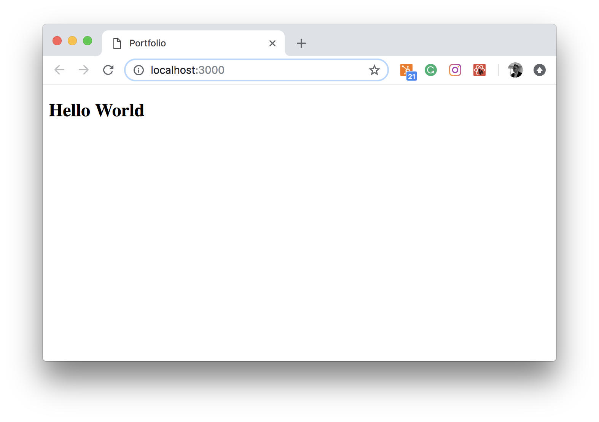

## Getting started with React

React is a popular JavaScript library for building user interfaces. It was created by developers at Facebook and has quickly became very popular among developers. One way to look at React is that it is the view layer for web applications (the V in Model - View - Controller), but it is much mare than that. 

React allows you to create highly reusable UI components like tab bars, comment boxes, pop up modals, lists, sortable tables, etc. Each of these componens, or custom HTML tags, can have their own functionality that displays relevant DOM elements. That is pretty convinient and makes web development more efficient and allows for richer user experience. If you want to know more about this library, head over to Facebook’s resources ["Why React?"](https://facebook.github.io/react/docs/why-react.html) and ["Why did we build React?"](https://facebook.github.io/react/blog/2013/06/05/why-react.html) as they thoroughly explain the technical design choices that make React particularly unique.

## The Project
In this course, we will be building a personal portfolio website. If you are takinkg part in the [Full Stack Web Developer Bootcamp](https://class.craftacademy.co/courses/course-v1:CraftAcademy+CA-CC-01+2018/about) from Craft Academy, this project and the quiz that follows, will be graded and become part of your projects portfolio. 

If you are taking this course as an indipendent module, your coach will grade your code and quiz submission before issuing a course certificate. 

## The setup 

It is very convienient to start your journey toward becoming a React-developer by using some of the many popular app generators. [Create React App](https://github.com/facebook/create-react-app) is a tool built by developers at Facebook to help you build React applications. It saves you from time-consuming setup and configuration by abstractin a lot of what makes a React app work away from you. However, there are a number of reasons you may want to make your own implementation, or at least have some idea of what it’s doing under the hood. 

One of the main cornerstones of the setup we will be doing is [Babel](http://babeljs.io/) and [Webpack](https://webpack.js.org/). We will go over these tools in more detail further down the road, but feel free to do some reading on your own in the meantime. 

Start by creating a new folder for your React application. Then, initialize your project with `npm init` (if you want to skip all the questions, add the `-y` flag to the command) and open it in an editor of your choice. I will be using [VSCode](https://code.visualstudio.com/) throughout this course.

Now is also a good time to initiate your git repository and make your fist commit. Remember to commit often and use version controll functionality if you get stuck or make some mistakes along the wat (i.e. feature branches and the `git reset --hard <commit hash>` command). 

When our applications will build, the source code will be placed in a specific folder (`dist`). Also, we will be installing a lot of external libraries that will reside in the `node_modules` folder. 
We want to exclude those folders from commits, so let’s go ahead and add a `.gitignore` file that will exclude those directories from version control.

### Execution

Now that you know what we want to achieve, let's run the following commands in your terminal:

```bash
$ mkdir react_portfolio
$ cd react_portfolio
$ npm init -y
$ git init
$ touch .gitignore
$ echo -e "node_modules/\n.DS_Store\n.vscode\ndist" >> .gitignore
$ git add .
$ git commit -am "initiates project and adds gitignore scaffold"
```
## The starting point

We will build our React application and transpile it to executable code that will run on all browser. We will be creating most of the files in our `src` folder, and since React is using ES6 features, let the bofore mentioned tools (Webpack and Babel) compile it for us into the `dist` folder.

Create the following folder structure for your project:

```
react_portfolio
+-- dist
+-- src
```
We also want to create a starting point for our application. We need an `index.html` file (in project's root folder) that will be loaded in the browser and hold our React application. 

You can use the following scaffold:

```html
<!DOCTYPE html>
<html>

<head>
    <meta charset="UTF-8" />
    <meta name="viewport" content="width=device-width, initial-scale=1, shrink-to-fit=no">
    <title>Portfolio</title>
</head>

<body>
    <div id="app"></div>
    <noscript>
        You need to enable JavaScript to run this React application.
    </noscript>
    <script src="dist/bundle.js"></script>
</body>

</html>

```

The most important part of the scaffold is the `<div id="app"></div>` tag, which is the root our React application will hook into, but also the `script` reference to `dist/bundle.js` that will hold our compiled code. The rest is pretty a much standard HTML skeleton.


### Execution

```bash
$ mkdir src
$ mkdir dist
$ touch index.html
$ code index.html
// add the html code to index.html
```

## React as dependency
To work with React, we need to install it. As simple as that. React can be added to your project using `npm`. 

## Execution

```bash
$ npm i -S react react-dom 
```
_Please note that `npm i -S` is the equivalet to `npm install --save`._

## Babel and Webpack

We need to make sure the code we write can be transpiled from ES6 to ES5, as not all browsers support ES6 yet. 

### What is ES6?

ES6 (ECMAScript) is a new version of JavaScript that adds some nice syntactical and functional additions. It was finalized in 2015. ES6 is almost fully supported by all major browsers. But it will be some time until older versions of web browsers are phased out of use. For instance, Internet Explorer 11 does not support ES6, but has about 12% of the browser market share.

### What is JSX?

JavaScript eXtension, or more commonly JSX, is a syntax extension to JavaScript that allows us to write JavaScript code that looks like HTML. With JSX you can write HTML code in JavaScript and have Babel transform these expressions into actual JavaScript code.

More specifically, JSX is a shorthand for calling `React.createElement` function. Since it’s JavaScript, we can execute JavaScript code inside JSX using `{}` curly-brace syntax. More about that later.

All in all, we need to install Babel. Let's break it down a bit more.

`@babel-core` is the main Babel package used to do any transformations on our code. `@babel-cli` lets you compile files from the command line. The other two packages,`@preset-react` and `@preset-env`, are presets that transform specific flavors of code. The `@preset-env` preset transpiles ES6 into more traditional JavaScript (ES5) and the `@preset-react` preset does the same with JSX.

We need to tell Babel that we want to use those presets. In the project's root folder, create a file called `.babelrc` and add the following setting in Json:

```json
{
    "presets": [
        "@babel/env",
        "@babel/preset-react"
    ]
}
```

### Execution
```bash
$ npm i -D @babel/core @babel/cli @babel/preset-env @babel/preset-react
$ touch .babelrc
// add the json code to .babelrc
```
_Please note that `npm i -D` is the equivalet to `npm install --save-dev`._


The next step is to install and configure Webpack. 

We need to install `webpack` as a development dependency and `webpack-cli` so that you can use webpack in the command line.

Webpack uses loaders to process different types of files for bundling. It also works easily alongside the development server that we’re going to use to serve our React project in development and reload browser pages on (saved) changes to our React components. 

To get all of this up and running, we need to configure Webpack to use our loaders and prepare the development server (`webpack-dev-server`). The following is a working setup for the `webpack.config.js` - a file you need to create in the project's root folder.

```js
const path = require("path");
const webpack = require("webpack");

module.exports = {
  entry: "./src/index.js",
  mode: "development",
  module: {
    rules: [
      {
        test: /\.(js|jsx)$/,
        exclude: /(node_modules)/,
        loader: "babel-loader",
        options: { presets: ["@babel/env"] }
      },
      {
        test: /\.css$/,
        use: ["style-loader", "css-loader"]
      }
    ]
  },
  resolve: { extensions: ["*", ".js", ".jsx"] },
  output: {
    path: path.resolve(__dirname, "dist/"),
    publicPath: "/dist/",
    filename: "bundle.js"
  },
  devServer: {
    contentBase: path.join(__dirname, "/"),
    port: 3000,
    publicPath: "http://localhost:3000/dist/",
    hotOnly: true
  },
  plugins: [new webpack.HotModuleReplacementPlugin()]
};
```

There are many parts here that call for a closer look. Do not take this lightly.

* `entry`  tells Webpack where our application starts and where to bundle our files. 

* `mode` lets Webpack know we’re working in development mode and saves us from having to add a mode flag when we run the development server.

* `module` is an object that defines how our exported javascript modules are transformed and which ones are included according to the given array of `rules`.

    * The first rule is about transforming ES6 and JSX syntax. The `test` and `exclude` properties are conditions to match files against. We will match anything that in NOT inside the `node_modules` folder. We also need to direct Webpack to use Babel.

    * The second rule configures how we will process CSS. At this point, we will not pre- or post-process our CSS. Meaning we just need to make sure to add `style-loader` and `css-loader` to the `use` property. Later on, we will take a closer look at SASS and will have to change these settings. 

* `resolve` allows us to specify which extensions Webpack will resolve — this allows us to import modules without needing to add their extensions.

* `output` property tells Webpack where to put our transpiled and bundled code. The `publicPath` property specifies what directory the bundle should go in, and tells `webpack-dev-server` where to serve files from. If `publicPath` is set incorrectly, we would be getting 404 errors when running the app, since the server would not be serving your files from the correct folder.

* `devServer` property configures the `webpack-dev-server` and specifies the location we will be using to serve static files from as well as the port we want to run the server on.

We also need to add a script to `package.json` to start the `webpack-dev-server`: 

```json
"scripts": {
    "start": "webpack-dev-server  --hot --inline --mode development --open"
}
```


## Execution
```bash
$ npm i -D webpack@4.19.1 webpack-cli@3.1.1 webpack-dev-server@3.1.8 style-loader@0.23.0 css-loader@1.0.0 babel-loader@8.0.2
$ touch webpack.config.js
// add the javscript code to webpack.config.js
// add the json code to package.json
```

## Our first component - Hello World

Let's create an `index.js` file in our `src` directory, build our first component and hook it in into the DOM. 

```javascript
import React from "react";
import ReactDOM from "react-dom";

const HelloWorld = () => {
    return <h2>Hello World</h2>;
};

ReactDOM.render(<HelloWorld />, document.getElementById("app"));
```

## Execution
```bash
$ touch src/index.js
// add the javscript code to src/index.js
```

## See it come alive!

We can start our dev server by executing the `start` script in our terminal, wait until Webpack and Babel does their job, and see our application come alive in the browser:

```bash
$ npm start
```




