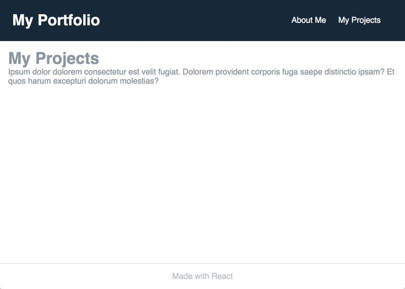

## Navigation

Our portfolio application is taking shape. In the previous section, we added a header and a footer to the page structure. Now, we want to extend our application with an "About Me" and a "Projects" section. There are many ways to achieve that, but for learning purposes, we will take a path that requires us to add dynamic routes to our application. The end result we are looking for is something like this:



## Router - the concept
Single-page applications (like the one we are building) rewrite sections of a page rather than loading entire new pages from a server. There are many examples of applications that do not render the entire page when you click a link or request new information from the server in another way. You've probably encountered this functionality on many of the popular sites out there. 

A router allows our application to navigate between different components, changing the browser URL, modifying the browser history, and keeping the UI state in sync. Routing is of uttermost importance in almost every application's architecture. The larger your app becomes, the more your routing functionality becomes complex, from simple to deeply nested routing scenarios.

As mentioned before, at its core React focuses only on building user interfaces, it doesn’t have a built-in solution for routing.

[React Router](https://reacttraining.com/react-router/) is the most popular routing library for React. It allows us to define routes in the same declarative style. The `Route` component is perhaps the most important component in React Router to understand and learn to use well. Its most basic responsibility is to render some UI when a location matches the route’s path.

React Router provides two Routers for us to use: `BrowserRouter` and `HashRouter`. We need to decide which one to use, and the choice will mostly depend on our server architecture.

`BrowserRouter` is the recommended default, but it may require additional server configuration to handle dynamic requests. `HashRouter` is not suitable for all situations, but it can be a good solution for static websites.

In our Portfolio application, we will use `BrowserRouter` as our Router of choice.

In the following section, we will use some of the basic functionality React Router brings to the table. If you want to go deeper into the router visit [this resource](https://reacttraining.com/react-router/core/guides/philosophy) and read through the documentation and examples.
 

## Getting started

As with every package, we will add the router using NPM and save it as a dependency.

```
$ npm i -S react-router-dom
```

We want to add 2 new components to our application. We will create them in `About.jsx` and `Projects.jsx` (in the `src`  folder).

```javascript
import React from "react"

const About = () => {
    return (
        <div>
            <h1 className="content-text">About Me</h1>
            <p className="content-text">Ipsum dolor dolorem consectetur est velit fugiat. Dolorem provident corporis fuga saepe distinctio ipsam? Et quos harum excepturi dolorum molestias?</p>
        </div>)
}

export default About
```

```javascript
import React from "react"

const Projects = () => {
    return (
        <div>
            <h1 className="content-text">My Projects</h1>
            <p className="content-text">Ipsum dolor dolorem consectetur est velit fugiat. Dolorem provident corporis fuga saepe distinctio ipsam? Et quos harum excepturi dolorum molestias?</p>
        </div>
    )

};

export default Projects
```

We also want to `import` those components, together with the `react-router-dom`, into our `index.js`.

```javascript
import { BrowserRouter } from 'react-router-dom'
import Projects from "./Projects"
import About from "./About"
```

Furthermore, we need to tell the application that we will be using the `BrowserRouter` when we hook the application into the `index.html`. We need to modify the `ReactDOM.render` function in `index.js` to the following markup:

```javascript
ReactDOM.render((
    <BrowserRouter>
        <App />
    </BrowserRouter>
), document.getElementById('app'));
```

## Switch and Route components
React Router has, among others, the `Switch` and `Route` components. The `Route` component renders a page if the current URL location matches the path prop specified in it. It also accepts `component`, `render` and `children` props. `Switch` will avoid inclusive route rendering and include a catch-all Route (if we add one at the bottom of the container). 

We need to import both these components into our `index.js`.

```javascript
import { Switch, Route } from 'react-router-dom'
```

We will put them to use in our `return` of our `App` component.

```javascript
    return (
        <div className="page-wrapper">
            <div className="page-content">
                <Header />
                <div className="content-wrapper">
                    <Switch>
                        <Route exact path='/' component={Hello}></Route>
                        <Route exact path='/about' component={About}></Route>
                        <Route exact path='/projects' component={Projects}></Route>
                    </Switch>
                </div>
                <Footer />
            </div >
        </div >
    )
``` 

## Link and NavLink components
As the last step, we need to display some links in our `Header` component. We will use the `Link` and `NavLink` components (for learning purposes). Both of them are made available for us by the React Router package.  

The `Link` component provides declarative, accessible navigation around an application. `NavLink` is a special version of the `Link` that will add styling attributes to the rendered element when it matches the current URL. We can style the active link using `activeClassName` or `activeStyle`.

We need to `import` both components to our `Header.jsx`.

```javascript
import { NavLink, Link } from 'react-router-dom';
```

And add them to our render function.

```javascript
return (
    <nav className="header">
        <h1 className="header-title">
            <Link className="text-white hover:text-grey no-underline" to='/'>My Portfolio</Link>
        </h1>
        <ul className="list-reset flex">
            <li className="mr-6"><NavLink className="text-white hover:text-grey no-underline" activeStyle={{fontWeight: "bold"}} to='/about'>About Me</NavLink></li>
            <li className="mr-6"><NavLink className="text-white hover:text-grey no-underline" activeStyle={{fontWeight: "bold"}} to='/projects'>My Projects</NavLink></li>
        </ul>
    </nav>
)
```
## Wrap up

I deliberately left the Tailwind classes in the markup above. Your job will be to extract these to custom classes and add them to `tailwind.src.css`. At this point, you know how to do make use of Tailwind classes in your own css classes using the `@apply` directive.  


