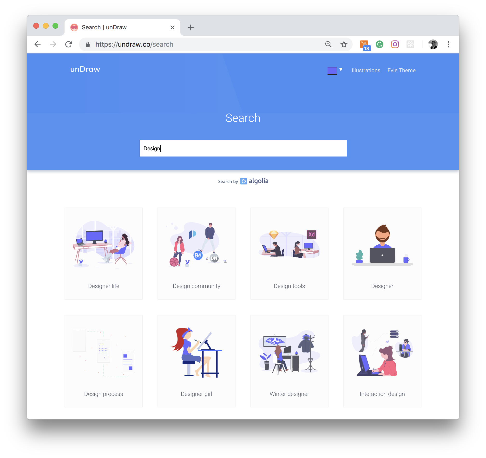
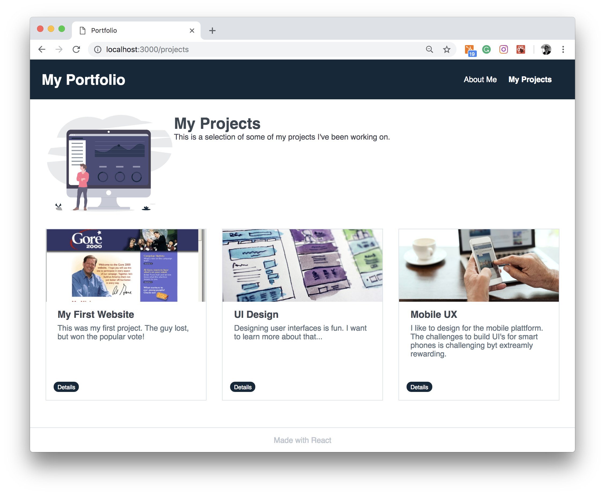

## Illustrations with unDraw

In this section of the course, we will focus on adding some illustrations to out portfolio while we continue to practice working with components and modifying them using props.

[unDraw](https://undraw.co/illustrations) is an online service that offers users to download open-source illustrations for every project you can imagine and create. All illustrations on the site are in SVG format (Scalable Vector Graphics). SVG is an XML-based vector image format for two-dimensional graphics with support for interactivity and animation. 


An enthusiast of the service came up with the briliant idea to transform illustrations hosted on unDraw to React components. You can find [unDraw illustrations as React components](https://www.npmjs.com/package/react-undraw-illustrations) as and NPM package.

My idea is that we use a few of the illustrations on our portfolio. 

## Adding unDraw to your application

The first thing we need to do is to add the `react-undraw-illustrations` package using NPM.

```bash
$ npm i -S react-undraw-illustrations
```
Adding an illustration is pretty straight forward, but require a bit of research. First you need to search for the appropoite illustration you want to display on the [unDraw website](https://undraw.co/illustrations).



The next step is to make sure that the illustration you want to use has been transformed into a component. The easiest way to do it is to look through the list of available illustrations on the [GitHub repository](https://github.com/GraemeFulton/react-undraw-illustrations/tree/master/lib/components). If you can find the illustration on the list of components, you will be able to use it in your application. **There are currently almost 370 illustrations to choose from.**


The naming of the components follows a certain standard. Let's say that you would like to display an illustration named "Designer". The name of the component to import and call would be `<UndrawDesigner />`. If the illustration is "Designer life", you would have to import and render `<UndrawDesignerLife />`. So prefixing the title with the word "Undraw", removing spaces (if there are any) and titleize all words is the standard to follow.  

Once we know the name of the component, displaying it on our UI is a breeze. I will show two examples, and add illustraions to our `<About />` and `<Projects />` components

First, we need to import the component we want to use. Let's start with adding "Designer life" to our "About me" page (`About.jsx`).

```javascript
import { UndrawDesignerLife } from 'react-undraw-illustrations';
```

The next step is to add the component to the JSX (I also modified the css a bit to display a grid):

```javascript
return (
        <div className="content-wrapper">
            <div className="flex flex-wrap mb-4">
                <div className="w-full lg:w-1/4 md:w-1/2">
                    <UndrawDesignerLife />
                </div>
                <div className="w-full lg:w-3/4 md:w-1/2">
                    <h1 className="content-text">About Me</h1>
                    <p className="content-text">Ipsum dolor dolorem consectetur est velit fugiat. Dolorem provident corporis fuga saepe distinctio ipsam? Et quos harum excepturi dolorum molestias?</p>
                </div>

            </div>
        </div>
    )
```

We can do a similar modification to the component in `Projects.jsx`. Here we want to display an image titled "Dashboard"


```javascript
import { UndrawDesigner } from 'react-undraw-illustrations';
```

And modify the JSX: 

```javascript
return (
        <div className="content-wrapper">
            <div className="flex mb-4">
                <div className="w-1/4">
                    <UndrawDashboard />
                </div>
                <div className="w-3/4">
                    <h1>My Projects</h1>
                    <p>This is a selection of some of my projects I've been working on.</p>
                </div>

            </div>

            <div className="flex flex-wrap -mx-1 lg:-mx-4">
                {projectsList}
            </div>
        </div>
    )

```

If you render your application in your browser, you should be able to see the illustrations. 



## Modify colors

There's a nice little feature in the `react-undraw-illustrations` package that allow you to some of the colors of the illustrations to have them fit your applications color profile better. You can also modify the height of the SVG. We can do that by passing in some `props`. 

For example, if you modify your coder with the following settings, you will see that the primary color will be inline with the header of our portfolio:

```javascript
<UndrawDashboard primaryColor='#12283a' height='200px' />
```

```javascript
<UndrawDesignerLife primaryColor='#12283a' height='200px' />
```

## Wrap up

In this section we made use of an Open Source library of illustration and leveraged on another OSS library that helped us to ude these illustration without having to go through the tedious process of having to downloading and including them in our application manually. 

Make sure to play around with various graphics and colors to give your portfolio a more personal look and feel.


