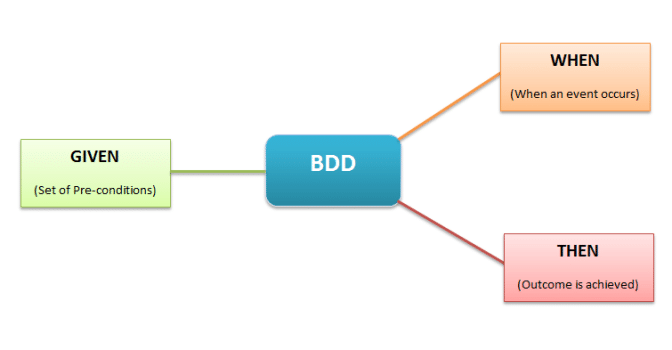
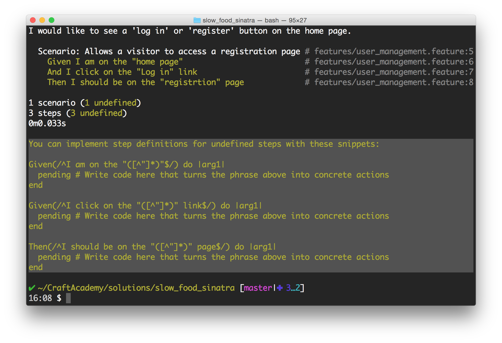

## Another look at BDD

**BDD (Behaviour Driven Development)** is a methodology for developing software through continuous example-based communication between developers, QAs and BAs. In this article we discuss some BDD Best Practices to get the most benefit.

More than anything else, the primary purpose of BDD methodology is to encourage communication amongst the stakeholders of the project so that the context of each feature is correctly understood by all members of the team (i.e. shared understanding), before development work starts. This helps in identifying key scenarios for each story and also eradicate ambiguities from requirements.

In BDD, Examples are called Scenarios. Scenarios are structured around the Context-Action-Outcome pattern and are written in a special format called Gherkin.

The scenarios are a way of explaining (in plain english) how a given feature should behave in different situations or with different input parameters.

Because Gherkin is structural, it serves both as a specification and input into automated tests, hence the term “Executable Specifications”.

**During this week you will see BDD in action and will experience, at least partially, the benefits of this method.**

The tools we will be using to test our application are **RSpec** for our unit tests and **Cucumber** for our acceptance tests. Those are the two so called **testing frameworks** that will help us to write good code. 

Cucumber (cucumber.io) is a testing framework used to describe high level functionality of your application. We will refer to them as **acceptance tests** or **features**. One of Cucumber's most compelling advantages is that it allows you to write these descriptions in plain text. Even in your native language.

During the development process, we'll take an approach that combines high level acceptance tests and low level unit tests to both drive the development process and make sure that we build a robust and well structured application.

### Test first - as we always do

Let's start with writing some high level acceptance tests.

What we want to do at this stage is to get the user stories we have defined together with our LoFi's and look at them from a user's perspective but also what an actual implementation of features would look like. 

In short, we want to take each user story and break it down to scenarios that each represents a use case in the application. Sounds confusing? It is, but look at it as a form of a blue print that you will use when we start to actually build the app.


A **feature** is one of your already defined **user stories**. It consists of one ore many  **scenarios**. A scenario is a sequence of **steps** through the feature that exercises one path.


A **scenario** is made up of 3 sections related to the 3 types of steps.



* **Given:** This sets up preconditions, or context, for the scenario.
* **When:** This is what the feature is talking about, the action, the behavior that we're focused on.
* **Then:** This checks post-conditions. It verifies that the right thing happen in the When stage.
* 
There is yet another type of step you can use in a scenario path, and that is the **And** keyword. **And** can be used in any of the three sections. It serves as a nice shorthand for repeating the **Given**, **When**, or **Then**. **And** stands in for whatever the most recent explicitly named step was.

For example, let's say that we want to test our user registration feature. In the newly created features folder, please create a `user_registers_an_account.feature` by returning to your terminal window and typing in:

```shell
$ touch features/user_registers_an_account.feature
```
Open that file and add the following code (this is a feature description AND the first of many scenarios that constitutes acceptance criteria of this feature) 

_user_registers_an_account.feature_

```gherkin
Feature: As a visitor
So that I can log in to the system and place orders
I would like to see a 'log in' or 'register' button on the home page.

Scenario: Allows a visitor to access a registration page
  Given I am on the "home" page
  And I click on the "Sign In" link
  Then I should be on the registration page
```

Now, run cucumber in your terminal. You will get a lot of errors that you should go over carefully. The terminal output might look something like this:

```shell
$ cucumber features/user_registers_an_account.feature
Feature: As a visitor
So that I can log in to the system and place orders
I would like to see a 'log in' or 'register' button on the home page.

  Scenario: Allows a visitor to access a registration page # features/user_registers_an_account.feature:5
    Given I am on the "home" page                         # features/user_registers_an_account.feature:6
    And I click on the "Sign in" link                       # features/user_registers_an_account.feature:7
    Then I should be on the registration page             # features/user_registers_an_account.feature:8

1 scenario (1 undefined)
3 steps (3 undefined)
0m0.033s
```

And you should also see something like this on your terminal:



This is perfectly normal. What Cucumber is doing is helping you in defining so called **step definitions**, that are the actual implementation of your tests (written in Ruby or JavaScript) so that they can be understood by the testing framework. 

Confusing? Let me get you started by implementing the steps above. 


Create a 2 files in the `features/step_definitions` folder. 

```shell
$ touch features/step_definitions/basic_steps.rb
$ touch features/step_definitions/assertion_steps.rb
```

Add the following code to the `basic_steps.rb` file 

_features/step_definitions/basic_steps.rb_

```ruby
You can implement step definitions for undefined steps with these snippets:

Given("I am on the {string} page") do |string|
  pending # Write code here that turns the phrase above into concrete actions
end

Given("I click on the {string} link") do |string|
  pending # Write code here that turns the phrase above into concrete actions
end
```

And add the following assertion to the `assertion_steps.rb` file:

```ruby
Then("I should be on the registration page") do
  pending # Write code here that turns the phrase above into concrete actions
end
```

At the moment all the above step definitions are empty, so we need to add some commands for each of the steps. I will introduce some Capybara commands to the **Given** steps and an assertion to the **Then** step. 

_features/step_definitions/basic_steps.rb_

```ruby
Given("I am on the {string} page") do |page|
  case page
  when 'home'
    visit '/' # or root_path
  end
end

Given("I click on the {string} link") do |element_text|
  click_on element_text
end
```

_features/step_definitions/assertion_steps.rb_

```ruby
Then("I should be on the registration page") do
  expect(current_path).to eq '/user/sign_up' # or new_user_registration_path
end
```

You probably recognize the `expect` command from your work with RSpec. What is new is the Capybara commands. So far, we only make use of 2 of quite many commands that are to our disposal. 

## Connon commands

Here is a summary of the most common Capybara and RSpec commands and matchers that you will end up using. 


### Navigating
```
    visit('/projects')

    visit(post_comments_path(post))
```

### Clicking links and buttons
```
    click_link('id-of-link')

    click_link('Link Text')

    click_button('Save')

    click_on('Link Text') # Click either a link or a button

    click_on('Button Value')
```

### Interacting with forms
```
    fill_in('First Name', with: 'John')

    fill_in('Password', with: 'Seekrit')

    fill_in('Description', with: 'Really Long Text…')

    choose('A Radio Button')

    check('A Checkbox')

    uncheck('A Checkbox')

    attach_file('Image', '/path/to/image.jpg')

    select('Option', from: 'Select Box')
```
### Scoping
```
    within("#new_employee_form") do
      fill_in 'Name', with: 'Thomas'
    end

    within(:css, "li#employee") do
      fill_in 'Name', with: 'Thomas'
    end

    within_fieldset('Employee') do
      fill_in 'Name', with: 'Thomas'
    end

    within_table('Employee') do
      fill_in 'Name', with: 'Thomas'
    end
```
### Querying
```   
    expect(page).to have_xpath('//table/tr')

    expect(page).to have_css('table tr.foo')

    expect(page).to have_content('foo')

    expect(page).not_to have_content('foo')

    find_field('First Name').value

    find_link('Hello').visible?

    find_button('Send').click

    find('//table/tr').click

    locate("//*[@id='overlay'").find("//h1").click
    
    all('a').each { |a| a[:href] }
```
### Scripting
```
    result = page.evaluate_script('4 + 4');
```
### Debugging
```
    save_and_open_page
```
### Final words
The above is just a simple introduction to working in a BDD style using Cucumber. Writing acceptance tests is about telling stories. The primary aim of the BDD methodology is to encourage communication amongst the delivery team. The aim of the feature files is to document the scenarios talked through in order to give an indication of how much work is involved in delivering the feature. The feature files are also the drivers for the automated tests. Feature files also serve as a definition of done (DoD), meaning that when all the scenarios have been implemented and tested successfully, we can mark the story as done.
