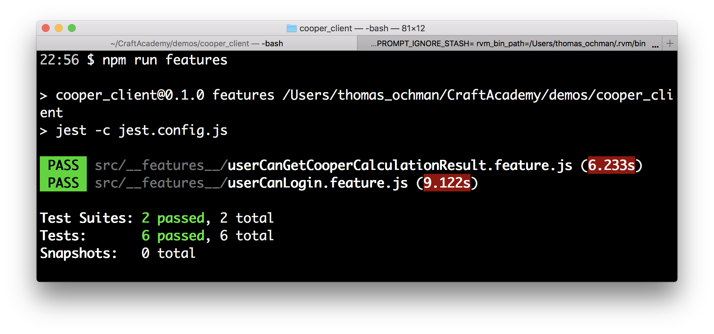

## User authentication

It is time to add some login functionality to our application. In order to be able to save results and show past results, we need to have a registered user.

We are going to start as usual with writing a feature test for this functionality. We start with creating a feature file and adding some besic tests (aka scenarios).

`$ touch  src/__features__/userCanLogin.feature.js`

This feature file should look like this:

```js
describe('User attempts to login', () => {

  beforeAll(async () => {
    jest.setTimeout(10000)
    await page.goto('http://localhost:3001');
  });

  beforeEach(async () => {
    await page.reload();
  })

  it('with valid credentials', async () => {
    await page.click('#login')
    await page.type('input[id="email"]', 'johndoe@mail.com')
    await page.type('input[id="password"]', 'password')
    await page.click('button[id="submit"]')
    await expect(page).toMatch('Hi johndoe@mail.com')
  })

  it('with invalid credentials', async () => {
    await page.click('#login')
    await page.type('input[id="email"]', 'wrongjohndoe@mail.com')
    await page.type('input[id="password"]', 'wronpassword')
    await page.click('button[id="submit"]')
    await expect(page).toMatch('Invalid login credentials. Please try again.')
  })
})

```

This feature is pretty straight forward. We click a login button which renders a login form. In the first scenario, we fill in the correct credentials and in the second one we fill in the wrong ones. Depending on if it is successful or not we will get a response which either welcomes the user or returns an error message.

Moving forward, when we work our way through the error messages and writing the implementation code, we only want to run the relevant feature file. We can ask jest to run a scecific test file by passing in a specific flag (`-t`) and adding the file name (or part of the file name) of the feature file we want to run. 

```bash
$ npm run features -t userCanLogin.feature.js
```

If we run the test now we get an error that states that the test can't find the selector `#login`. Let's start with adding a button to our `App` component.

```js
// src/App.js

...

 render() {
    return (
      <div>
        <InputFields 
          inputChangeHandler={this.onChange.bind(this)}
        />

        <button id="login">Login</button>

        <DisplayCooperResult
          distance={this.state.distance}
          gender={this.state.gender}
          age={this.state.age}
        />
      </div>
    );
  }
}
```
That takes care of the first error. Now, we have a different error that is very similiar to the previous one. It can't find the input field for filling in the email. Part of the error output in your terminal reads:

```
No node found for selector: input[id="email"]
```

At this point, we want to create a new component for the login form. This component should have input fields for the credentials and a button to submit them.

Let's create this login form component:

```shell
$ touch src/Components/LoginForm.js
```

Add the following code to that file:

```js
import React from 'react';

const LoginForm = () => {
  return (
    <form>
      <div>
        <label >Email</label>
        <input id="email"></input>
      </div>

      <div>
        <label>Password</label>
        <input id="password"></input>
      </div>
      <button id="submit">Submit</button>
    </form>
  )
}

export default LoginForm;

```

If we run the test again, we will see no difference in the output. That is because we don't use this component anywhere, we don't render it.
In the app component, we need to import it and render it.

Modify `App.js` with the following code.

```js
import React, { Component } from 'react';
import './App.css';
import DisplayCooperResult from './DisplayCooperResult'
import LoginForm from './Components/LoginForm';


class App extends Component {
 // ...

 render() {
    return (
      <div>
        {/* ... */}
        <button id="login">Login</button>
        <LoginForm />
      </div>
    );
  }
}

export default App;
```

If you run the feature test now, it will complain about not finding the text that we are expecting to find.
So at the moment, the test can find all of the elements it needs to fulfill its task. The flow that we want is that when the user clicks the login button we want the login form to render. At the moment we have a button that does nothing. If you run the application you can see that.

We want to add an object to our state to determine if the LoginForm should be rendered or if we want to display the login button. Then, we want to condition what is being rendered (in the components `render` method), based on that state. 

We need to update the App component to look like this:

```js
import React, { Component } from 'react';
import DisplayCooperResult from './Components/DisplayCooperResult';
import InputFields from "./Components/InputFields";
import LoginForm from './Components/LoginForm';


class App extends Component {
  constructor(props) {
    super(props);
    this.state = {
      distance: '',
      gender: 'female',
      age: '',
      renderLoginForm: false
    }
  }

  onChange(event) {
    this.setState({
      [event.target.id]: event.target.value
    });
  }

  render() {
    let renderLogin

    if (this.state.renderLoginForm === true) {
      renderLogin = (
        <LoginForm />
      )
    } else {
      renderLogin = (
        <button id="login" onClick={() => this.setState({ renderLoginForm: true })}>Login</button>
      )
    }
    return (
      <div>
        <InputFields 
          inputChangeHandler={this.onChange.bind(this)}
        />

        <DisplayCooperResult
          distance={this.state.distance}
          gender={this.state.gender}
          age={this.state.age}
        />
        {renderLogin}

      </div>
    );
  }
}

export default App;
```

So we have added a state called `renderLoginForm` in the constructor. That state is going to decide if the application should render the login button or the login form.

At the beginning of the render method, we declare a variable called `renderLogin`. Depending on whether the `renderLoginForm` state is equal to true or false, this variable will contain the login form or the login button. So if the `renderLoginForm` state is true it will set the variable to render the login form, if it's false, it will render the login button.

We have added an `onClick` to the login button. If the user press it, it will switch the `renderLoginForm` state to true. Since we are changing state using the `setState()` function, that also means that the component will be re-rendered and login form will show up on the page. This variable (`renderLogin`) where we store all of this, needs to be added to the return in the render method, we have placed it underneath the `DisplayCooperResult` component.

Run the application to make sure that this works and that the visibility of the login form is toggled.

If you run the feature test again, you will see that the change we made has not changed the error message fromthe one we got before. We need to add some logic to our component in order to make the login flow work. 

We are going to add a method called `onLogin` that is going to authenticate the user against the backend system. 

First, you need to add this method to the App component:

```js
async onLogin(e) {
  e.preventDefault();
  let resp = await authenticate(this.state.email, this.state.password)
  if (resp.authenticated === true) {
    this.setState({ authenticated: true });
  } else {
    this.setState({ message: resp.message, renderLoginForm: false })
  }
}
```
As you can see we have added some more objects to out state. We need to add default values to the constructor.

```js
  constructor(props) {
    super(props);
    this.state = {
      distance: '',
      gender: 'female',
      age: '',
      renderLoginForm: false,
      authenticated: false,
      email: '',
      password: '',
      message: ''
    }
  }
```
We also need to add some props to the rendering of the `LoginFrom` component.

```js
<LoginForm
  loginHandler={this.onLogin.bind(this)}
  inputChangeHandler={this.onChange.bind(this)}
/>
```

What we do here is that every time we change the input fields in the `LoginForm` component we will update the state of email and password. We also add so that when the submit button is clicked, we run the `onLogin` method here in the `App` component. To make this work we need to make some changes in the `LoginForm` component.'

```js
import React from 'react';

const LoginForm = (props) => {
  return (
    <form>
      <div>
        <label >Email</label>
        <input id="email" onChange={props.inputChangeHandler}></input>
      </div>

      <div>
        <label>Password</label>
        <input id="password" onChange={props.inputChangeHandler}></input>
      </div>
      <button onClick={(e) => props.loginHandler(e)} id="submit">Submit</button>
    </form>
  )
}

export default LoginForm;
```
If you run the test now, all of them will fail. The app complains about how `authenticate` in the `App` component is not defined. 

Like we did with the `CooperCalculator`, we will extract the login function to a separate module. That is what we are trying to call on with `authenticate` in the `onLogin` function. 

We will make a call to our backend API over the network and will need to add a library to be able to perform that call. The library we will use is Axios. You install it like this:

```bash
$ npm i -S axios
```

Let's add that module:

`$ touch src/Modules/Auth.js`

Add this there:

```js
import axios from 'axios'

// const apiUrl = 'http://localhost:3000/api/v1';
const apiUrl = 'http://localhost:3000/';


const authenticate = async (email, password) => {
  const path = apiUrl + '/auth/sign_in';
  try {
    let response = await axios.post(path, { email: email, password: password })
    await storeAuthCredentials(response)
    return { authenticated: true }
  } catch (error) {
    return { authenticated: false, message: error.response.data.errors[0] }
  }
};

const storeAuthCredentials = ({ data, headers }) => {
  return new Promise((resolve) => {
    const uid = headers['uid'],
      client = headers['client'],
      accessToken = headers['access-token'],
      expiry = headers['expiry'];

    sessionStorage.setItem('credentials', JSON.stringify({
      uid: uid,
      client: client,
      access_token: accessToken,
      expiry: expiry,
      token_type: 'Bearer'
    }));
    sessionStorage.setItem('current_user', JSON.stringify({ id: data.data.id }));
    resolve(true)
  })
};

export { authenticate }
```

You will also need to add the axios package with npm, run `npm i axios -S`

We also need to import this to the `App` component:

```js
import { authenticate } from './Modules/Auth';

```

In the backend, make sure that you have a user that has `johndoe@mail.com` as the email and `password` as the password.

If you run the test and have the backend running locally, you will see that we still get the same error message about how it can't find the text that we are expecting to see. But, we got rid of the error message that we got when we ran the application about how `authenticate` is not defined. If you take a look at the terminal window where you run the backend, you can actually see that we hit it two times, one successful and one not successful. Now it just a question of fetching the response and display it to the user.

So, if we login successfully and store the user in the `sessionStorage`, we want to to display `Hi johndoe@mail.com`. On the other hand, if the login is not successful, we send back the message we get from the response back to the `onLogin` function and store it in a state called message. We want to display that message our page. 

Modify the code in the `render` method for the `App` component to look like this:

```js
render() {
    let renderLogin;
    let user;

    if (this.state.authenticated === true) {
      user = JSON.parse(sessionStorage.getItem('credentials')).uid;
      renderLogin = (
        <p>Hi {user}</p>
      )
    } else {
      if (this.state.renderLoginForm === true) {
        renderLogin = (
          <>
            <LoginForm 
              loginHandler={this.onLogin.bind(this)}
              inputChangeHandler={this.onChange.bind(this)}
            />
          </>
        )
      } else {
        renderLogin = (
          <>
            <button id="login" onClick={() => this.setState({ renderLoginForm: true })}>Login</button>
            <p>{this.state.message}</p>
          </>
        )
      }
    }
    
    return (
      // <...>
    );
  }

```
If you run the tests now with the backend running, everything should go green!



If the tests still fails, it might be that the test is to quick to look for the message. You need to tell the test to wait a bit before expecting to find the message so it has time to render. We can do slow things down by adding a timeout: `await page.waitFor(1000)`.

E.g.

```js
  it('with valid credentials', async () => {
    await page.click('#login')
    await page.type('input[id="email"]', 'johndoe@mail.com')
    await page.type('input[id="password"]', 'password')
    await page.click('button[id="submit"]')
    await page.waitFor(1000)
    await expect(page).toMatch('Hi johndoe@mail.com')
  })

  it('with invalid credentials', async () => {
    await page.click('#login')
    await page.type('input[id="email"]', 'wrongjohndoe@mail.com')
    await page.type('input[id="password"]', 'wronpassword')
    await page.click('button[id="submit"]')
    await page.waitFor(1000)
    await expect(page).toMatch('Invalid login credentials. Please try again.')
```

